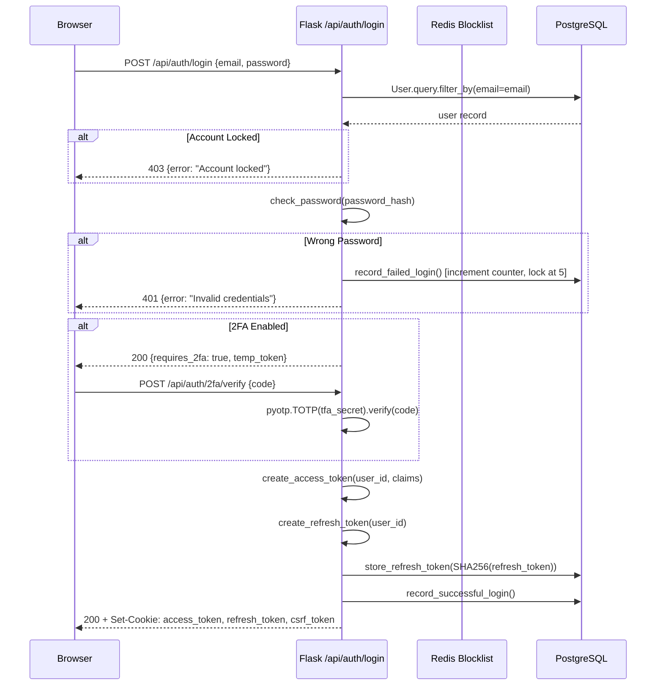
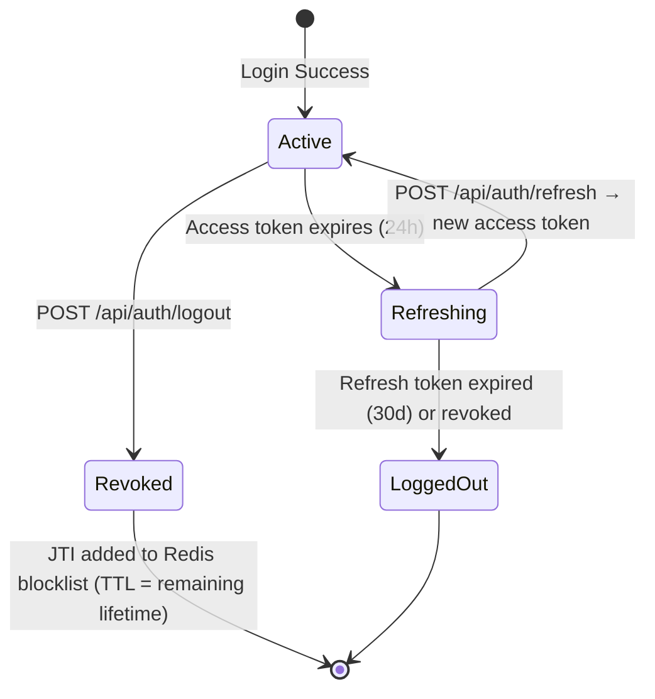
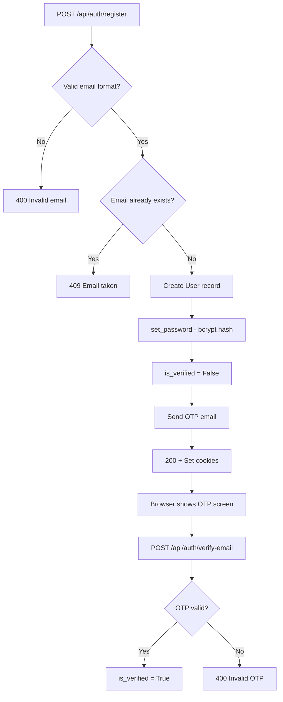
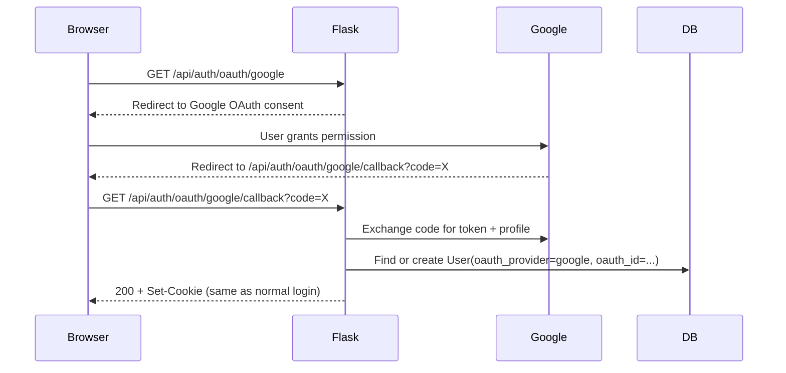
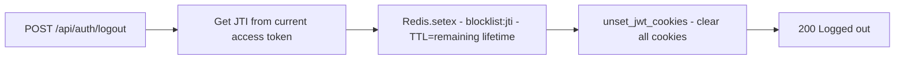
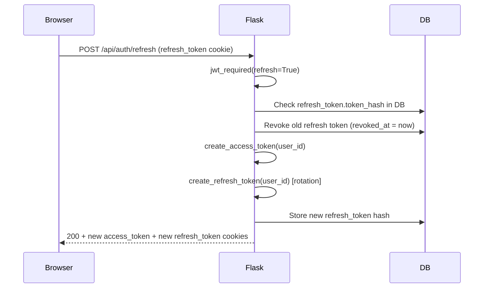

# 03 — Authentication & Login Flow

> **Back to Index**: [00_index.md](00_index.md)

---

## 3.1 Authentication Overview

ResearchAI uses **Flask-JWT-Extended** in **HTTPOnly cookie mode**. Tokens are never exposed to JavaScript — they ride in `HttpOnly; SameSite=Lax; Secure` cookies, making XSS token theft impossible.

### Token Types

| Token | Lifetime | Storage | Scope |
|-------|----------|---------|-------|
| Access Token | 24 hours | HTTPOnly cookie (`/`) | All API calls |
| Refresh Token | 30 days | HTTPOnly cookie (`/api/auth/`) | Token rotation only |

### CSRF Protection
Every state-changing request (`POST`, `PUT`, `DELETE`) must include a `X-CSRF-TOKEN` header. The CSRF token is embedded in a readable (non-HttpOnly) cookie that JavaScript can access and forward as a header. This is the **double-submit pattern**.

---

## 3.2 Login Sequence Diagram



---

## 3.3 Token Lifecycle



### JWT Claims Structure
Every JWT access token carries these additional claims (embedded at login, no DB hit needed per request):

```json
{
  "sub": "uuid-of-user",
  "role": "student",
  "email": "user@example.com",
  "scope": "own",
  "institute_id": null,
  "exp": 1234567890,
  "jti": "unique-token-id"
}
```

**Scope values**: `global` (super_admin), `institute` (admin), `public` (marketing), `assigned` (support_agent), `own` (all other roles).

---

## 3.4 Authentication Middleware (`token_required`)

Every protected route uses the `@token_required` decorator defined in `routes/user.py`:

```python
def token_required(f):
    @wraps(f)
    @jwt_required()
    def decorated(*args, **kwargs):
        request.user_id = get_jwt_identity()
        request.user_claims = get_jwt()
        return f(*args, **kwargs)
    return decorated
```

Flask-JWT-Extended handles:
1. Extracting the JWT from the `access_token_cookie`
2. Verifying signature and expiry
3. Calling `check_if_token_revoked()` → Redis O(1) lookup
4. Populating `flask.g` with identity

---

## 3.5 Registration Flow



---

## 3.6 Password Security

- Passwords are hashed using **Werkzeug's `generate_password_hash`** (PBKDF2-SHA256 by default).
- Plain-text passwords are **never stored or logged**.
- Account lockout: **5 failed attempts → 15-minute lockout** (`locked_until` field on User model).
- Anti-enumeration: both "email not found" and "wrong password" return the same generic error message.

---

## 3.7 OAuth Flow (Google / Facebook)



---

## 3.8 Two-Factor Authentication (2FA / TOTP)

- Uses **pyotp** (RFC 6238 TOTP implementation).
- `tfa_secret` stored in the `users` table (encrypted at rest by PG disk encryption).
- When `tfa_enabled = True`: login returns `{requires_2fa: true}`, browser redirects to 2FA screen.
- POST `/api/auth/2fa/verify` validates the 6-digit code against `pyotp.TOTP(secret).verify()`.
- 30-second time window is enforced automatically by pyotp.

---

## 3.9 Logout Flow



The JTI (JWT ID) is stored in Redis with a TTL equal to the token's remaining valid lifetime. When the token would have expired, the Redis key auto-deletes — no manual cleanup needed.

---

## 3.10 Token Refresh Flow



Token rotation ensures that stolen refresh tokens become invalid after one use.

---

## 3.11 Protected Route Authorization Matrix

| Route Pattern | Required Role | Scope Check |
|---------------|--------------|-------------|
| `/api/user/*` | Any authenticated | `own` — user_id match |
| `/api/projects/*` | Any authenticated | Project.user_id == jwt.sub |
| `/api/papers/*` | Any authenticated | Paper → Project.user_id == jwt.sub |
| `/api/admin/*` | `admin` or `super_admin` | institute_id match |
| `/api/super/*` | `super_admin` only | Global |
| `/api/paraphraser/*` | Any authenticated | own |
| `/api/plagiarism/*` | Any authenticated | own |

---

## 3.12 PostgreSQL Row-Level Security (RLS)

`db_session_events.py` listens for SQLAlchemy `before_cursor_execute` events and injects:

```sql
SET LOCAL app.current_user_id = '<uuid>';
SET LOCAL app.current_role = '<role>';
SET LOCAL app.current_scope = '<scope>';
```

PostgreSQL RLS policies then enforce these at the DB level automatically, providing a second layer of data isolation even if Flask-level checks are bypassed.
