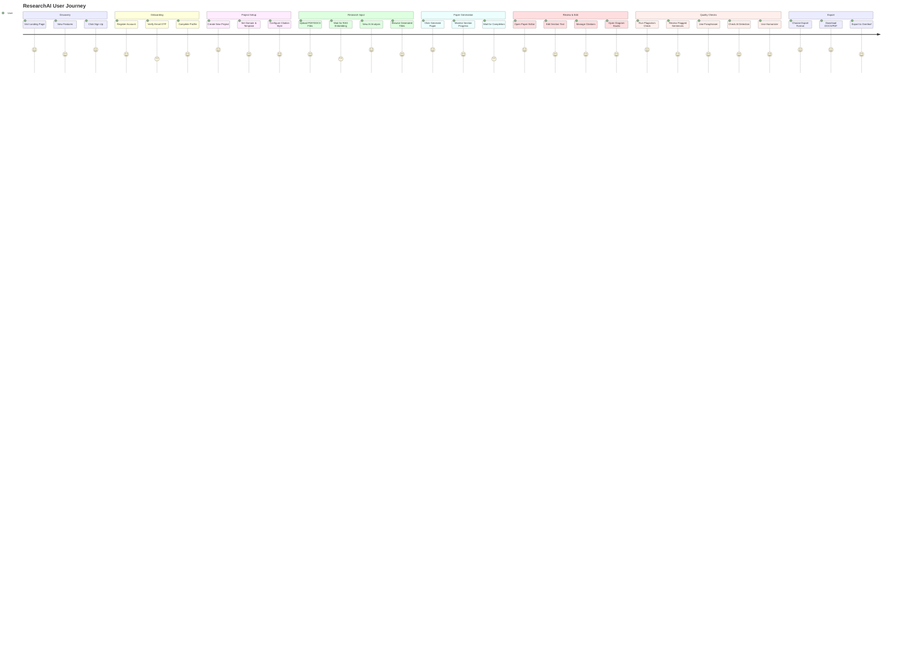

# 04 — User Journey

> **Back to Index**: [00_index.md](00_index.md)

---

## 4.1 End-to-End User Flow



---

## 4.2 Detailed Feature Walkthrough

### Step 1: Landing Page
**Screen**: `screenLanding` (`authLanding.js`)  
The landing page presents the product value proposition, feature highlights, and pricing. No authentication required. Contains CTA buttons to Register/Login.

---

### Step 2: Registration & Email Verification
**Screen**: `screenRegister` (`authRegister.js`)  
**API**: `POST /api/auth/register`

1. User enters name, email, password.
2. OTP email is sent automatically.
3. Browser redirects to OTP screen.
4. User enters 6-digit OTP → `POST /api/auth/verify-email`.
5. `is_verified = True`, auth cookies set, redirected to Dashboard.

---

### Step 3: Dashboard
**Screen**: `screenDashboard` (`screens/user.js`)  
Shows recent projects, paper status cards, notification badges, quick action buttons (New Project, Recent Papers). Loaded via `dashboardService.js`.

---

### Step 4: Create Project
**Screen**: `screenNewProject` (`projectSetup.js`)  
**API**: `POST /api/projects`

User sets:
- **Research Domain** (e.g., Computer Science, Medicine)
- **Citation Style** (IEEE, APA, MLA, Chicago)
- **Journal Template** (IEEE Conference, Springer, Elsevier, etc.)
- **Target Length** (pages)
- **Paper Title** (or generate suggestions later)

Project created in DB → redirected to Upload screen.

---

### Step 5: Upload Documents
**Screen**: `screenUpload` (`upload.js`)  
**API**: `POST /api/documents/<project_id>/upload`

User uploads 1-20 PDF, DOCX, or TXT reference files.

Behind the scenes:
1. File saved to `uploads/` (or S3).
2. `text_extractor.py` extracts text (OCR for scanned PDFs).
3. `embed_document` Celery task triggered:
   - LangChain splits text into 1000-char chunks (200 overlap)
   - SentenceTransformer encodes chunks locally
   - Vectors upserted to Pinecone namespace `project_<uuid>`
4. Document status updated: `uploaded → processing → embedded`.

---

### Step 6: AI Analysis
**Screen**: `screenAIAnalysis` (`analysis.js`)  
**API**: `POST /api/papers/<id>/analyze`

AI extracts from all project documents:
- **Keywords** (thematic terms from source material)
- **Topics** (high-level research themes)
- **Research Gaps** (what the literature hasn't addressed)
- **Methodology Notes** (how prior work was conducted)
- **Suggested Titles** (3-5 AI-generated paper titles)

Results stored in `AIAnalysis` model. User reviews and selects preferred title.

---

### Step 7: Generate Paper
**Screen**: `screenGeneration` (`generation.js`)  
**API**: `POST /api/papers/<id>/generate` → triggers Celery task

The `paper_tasks.generate_paper_task` Celery job runs:

```
For each section [abstract, introduction, literature_review, research_gap,
                  methodology, system_architecture, implementation,
                  results, discussion, conclusion, future_work]:

  1. Query Pinecone for top-5 relevant chunks
  2. Build grounded system prompt + section instruction
  3. Call call_ai() → multi-model router
  4. Save generated text to Paper.<section> column
  5. Update Paper.progress (0→100)
  6. Send notification on completion
```

The UI polls `GET /api/papers/<id>/status` every 3 seconds to show live progress.

---

### Step 8: Paper Editor
**Screen**: `screenEditor` (`editor.js`)  
**API**: `GET /api/papers/<id>`, `PUT /api/papers/<id>/sections/<key>`

Full WYSIWYG-style editor:
- View all sections with inline formatting toolbar (Bold, Italic)
- Edit any section inline
- Citations rendered as `[[cite:UUID]]` → formatted badge display
- Diagram placeholders `[[diagram:UUID]]` → visual card display
- Version history tab (restore previous snapshots)
- Source library sidebar

---

### Step 9: Citation Management
**Screen**: `screenCitations` / `screenCitationWorkspace`  
**API**: `GET /api/papers/<id>/citations`, `POST /api/papers/<id>/citations`

- All citations discovered during generation are listed
- User can add, edit, verify, or remove citations
- Citation styles: IEEE `[1]`, APA `(Author, 2020)`, MLA, Chicago
- Bibliography auto-rendered at bottom of paper

---

### Step 10: Diagram Studio
**Screen**: `screenDiagrams` (`diagrams.js`)  
**API**: `POST /api/papers/<id>/diagrams/opportunities`, `POST /api/papers/<id>/diagrams/generate`

1. **Scan**: AI scans paper sections in batches of 5 paragraphs, identifies ideal locations for diagrams
2. **Select**: User picks a recommended location and diagram type (Flowchart, Mind Map, Sequence Diagram, **AI Illustration**)
3. **Generate**: Backend generates either:
   - Mermaid.js SVG code (structural diagrams)
   - NVIDIA Stable Diffusion XL image (AI Illustrations)
4. **Insert**: "Save & Insert Diagram/Image" button embeds `[[diagram:UUID]]` tag in paper
5. **Edit**: Properties sidebar with Mermaid code editor, theme selector, caption input, version history

---

### Step 11: Plagiarism Check
**Screen**: `screenPlagiarism` (`plagiarism.js`)  
**API**: `POST /api/papers/<id>/plagiarism/scan`

Triggers 4-step Celery chord pipeline:
1. **Preprocessing**: Tokenize paper into sentences
2. **Exact Match**: PostgreSQL trigram + MinHash fingerprinting against all project documents
3. **Semantic Match**: SentenceTransformer cosine similarity for paraphrase detection
4. **AI Verification**: LLM confirms borderline matches, filters false positives

Results show:
- Overall plagiarism score (%)
- Per-sentence flagged text with source reference
- Side-by-side source comparison

---

### Step 12: Paraphraser
**Screen**: `screenParaphraserWorkspace` (`paraphraserWorkspace.js`)  
**API**: `POST /api/paraphraser/<paper_id>/paraphrase`

User selects flagged sentences or any text. Paraphraser rewrites while:
- Preserving inline citations `[[cite:UUID]]`
- Maintaining semantic meaning
- Using configured LLM (DeepSeek V4-Flash primary)

---

### Step 13: Humanizer
**Screen**: `screenAIHumanizer` (`humanizer.js`)  
**API**: `POST /api/papers/<id>/humanize`

4-phase pipeline (see [Humanizer Pipeline](15_humanizer_pipeline.md)):
1. **Pattern Removal** — 30+ AI phrase replacements
2. **Burstiness Control** — sentence length variation
3. **LLM Deep Rewrite** — forensic humanization prompt
4. **Word Diff** — highlights every change

Shows before/after scores, improvement delta, and annotated diff view.

---

### Step 14: AI Detection
**Screen**: `screenAIDetection` → `screenAIDetectionReport`  
**API**: `POST /api/papers/<id>/detect-ai`

6 statistical signals + LLM zero-shot classifier ensemble.
Produces:
- Overall AI score (0-100%)
- Classification: Human-written / AI-assisted / AI-generated
- Per-sentence analysis with highlighting
- Recommendations to improve human score

---

### Step 15: Export & Download
**Screen**: `screenExport` (`export.js`)  
**API**: `POST /api/export/<paper_id>/docx`, `/pdf`, `/latex`, `/overleaf`

Export options:
- **DOCX**: Template-formatted (IEEE, APA, etc.) with citations resolved
- **PDF**: Via DOCX → PDF conversion
- **LaTeX**: Full `.tex` file with bibliography
- **Overleaf**: Direct zip upload to Overleaf project

All exports:
- Replace `[[cite:UUID]]` with formatted citation strings
- Remove `[[diagram:UUID]]` tags (replaced with embedded content)
- Apply journal template formatting (margins, fonts, column layout)
