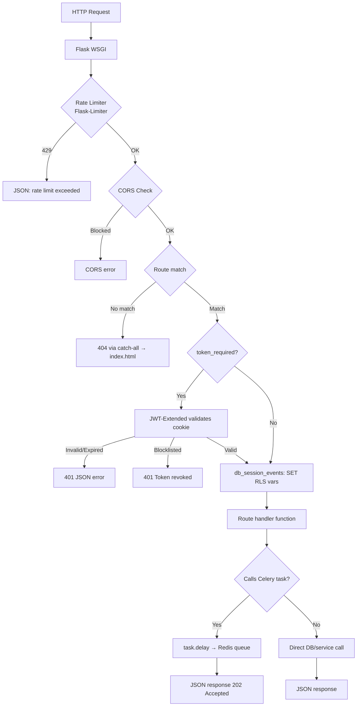

# 06 — Backend Architecture

> **Back to Index**: [00_index.md](00_index.md)

---

## 6.1 Framework & Structure

**Framework**: Flask (Python 3.11)  
**Pattern**: Blueprint-based modular routing  
**ORM**: SQLAlchemy via Flask-SQLAlchemy  
**Task Queue**: Celery with Redis broker  
**Auth**: Flask-JWT-Extended (HTTPOnly cookie mode)  
**Rate Limiting**: Flask-Limiter (Redis backend)

---

## 6.2 Application Factory Pattern

`app.py` uses the Flask application factory pattern (`create_app()`). This:
- Allows testing with different configs
- Prevents circular imports
- Enables multiple app instances

**Extension initialization order** (critical — must not be reordered):
1. `db.init_app(app)` — SQLAlchemy
2. `migrate.init_app(app, db)` — Flask-Migrate
3. `jwt_manager.init_app(app)` — JWT
4. `limiter.init_app(app)` — Rate limiter
5. `init_rls_events(app)` — PostgreSQL RLS
6. `celery_init_app(app)` — Celery
7. Blueprint registration

---

## 6.3 Blueprint Map

| Blueprint | Prefix | File | Responsibility |
|-----------|--------|------|----------------|
| `auth_bp` | `/api/auth` | `routes/auth.py` | Login, register, 2FA, OAuth, token refresh |
| `user_bp` | `/api/user` | `routes/user.py` | Profile, notifications, subscription, usage |
| `project_bp` | `/api/projects` | `routes/project.py` | Project CRUD, settings |
| `document_bp` | `/api/documents` | `routes/document.py` | File upload, library, OCR, delete |
| `paper_bp` | `/api/papers` | `routes/paper.py` | Generation, editing, analysis, diagrams, plagiarism |
| `export_bp` | `/api/export` | `routes/export.py` | DOCX, PDF, LaTeX, Overleaf |
| `admin_bp` | `/api/admin` | `routes/admin.py` | Institution admin panel |
| `super_admin_bp` | `/api/super` | `routes/super_admin.py` | Platform super admin |
| `paraphraser_bp` | `/api/paraphraser` | `routes/paraphraser.py` | Paraphrasing |
| `standalone_plagiarism_bp` | `/api/plagiarism` | `routes/standalone_plagiarism.py` | Text-only scan |
| `marketing_bp` | `/api/marketing` | `routes/marketing.py` | Public landing data |
| `support_bp` | `/api/support` | `routes/support.py` | Support agent endpoints |

---

## 6.4 Request Lifecycle



---

## 6.5 The `paper_bp` — Largest Route Module

`routes/paper.py` (~2756 lines) is the most complex blueprint. Key endpoint groups:

| Endpoint Group | Lines | Purpose |
|----------------|-------|---------|
| Paper CRUD | ~1-200 | Create, read, update, delete papers |
| Section editing | ~200-500 | Edit individual sections, save snapshots |
| Analysis | ~500-800 | AI keyword/gap/title extraction |
| Generation | ~800-1100 | Start generation, status polling |
| Citation management | ~1100-1500 | CRUD for citations |
| Plagiarism | ~1500-1800 | Scan triggers, status, results |
| Humanizer | ~1800-2000 | AI humanization endpoints |
| AI Detection | ~2000-2200 | Detection endpoints |
| Diagram Studio | ~2200-2756 | Opportunities, generation, CRUD |

---

## 6.6 Service Layer

Business logic is separated from routes into service/utility files:

```
Route (validates input + auth)
  └── Utility/Service (business logic)
        └── Model (DB access)
```

| Service | Location | Consumed By |
|---------|----------|-------------|
| RAG context retrieval | `utils/pinecone_search.py` | `paper_genration/generation.py` |
| Paper section generation | `paper_genration/generation.py` | `tasks/paper_tasks.py`, `paper_bp` |
| Citation processing | `utils/citation_processor.py` | `paper_bp`, `export_bp` |
| AI routing | `utils/ai_router.py` | All AI features |
| Humanizer | `utils/ai_humanizer.py` | `paper_bp`, `paper_genration/humanize.py` |
| AI detector | `utils/ai_detector.py` | `tasks/ai_detection_tasks.py` |
| Paraphraser | `utils/paraphraser_engine.py` | `tasks/paraphraser_tasks.py` |
| Plagiarism engine | `utils/plagiarism_engine.py` | `tasks/plagiarism_tasks.py` |
| Text extraction | `utils/text_extractor.py` | `routes/document.py` |

---

## 6.7 Database Layer

All DB access uses SQLAlchemy ORM:

```python
# Pattern: query → verify ownership → operate → commit
paper = Paper.query.get_or_404(paper_id)
if paper.project.user_id != request.user_id:
    return jsonify({"error": "Forbidden"}), 403
paper.status = "completed"
db.session.commit()
```

**Connection pool settings** (from `config.py`):
- Pool size: 10 persistent connections
- Max overflow: 20 (burst capacity, total max: 30)
- Pool timeout: 30 seconds
- Pool recycle: 1800 seconds (prevents PostgreSQL idle timeout kills)
- Pre-ping: True (validates connection liveness before use)

**Session management in Celery**:
```python
class FlaskTask(Task):
    def __call__(self, *args, **kwargs):
        with app.app_context():
            try:
                return self.run(*args, **kwargs)
            finally:
                db.session.remove()  # Return connection to pool
```

---

## 6.8 Error Handling

**Route level**:
```python
try:
    result = some_operation()
    return jsonify(result), 200
except ValueError as e:
    return jsonify({"error": str(e)}), 400
except Exception as e:
    logger.error(f"Unexpected error: {e}", exc_info=True)
    return jsonify({"error": "Internal server error"}), 500
```

**Global handlers** (registered in `create_app()`):
- `429` → `{"error": "Rate limit exceeded: <description>"}`
- JWT errors → `{"error": "..."}` with 401

**Celery task errors**:
- Tasks catch exceptions and update `ScanTask.status = "failed"` + `error_msg`
- Celery retries on transient errors (3 attempts, 30s delay)
- After `MaxRetriesExceededError` → permanent failure written to DB

---

## 6.9 Validation

Input validation is done manually in route handlers:

```python
data = request.get_json(silent=True) or {}
paragraph_text = data.get("paragraph_text", "")
if not paragraph_text:
    return jsonify({"error": "paragraph_text is required"}), 400
if len(paragraph_text) > 10000:
    return jsonify({"error": "Text too long"}), 400
```

No schema validation library (like Marshmallow or Pydantic) is used — this is a technical debt item.

---

## 6.10 Celery Configuration

```python
celery_app.config_from_object({
    "broker_url": "redis://localhost:6379/0",
    "result_backend": "redis://localhost:6379/0",
    "task_serializer": "json",
    "result_expires": 3600,
    "task_track_started": True,
    "broker_connection_retry_on_startup": True,
    "include": [
        "tasks.paper_tasks",
        "tasks.embed_document",
        "tasks.plagiarism_tasks",
        "tasks.standalone_plagiarism_tasks",
        "tasks.paraphraser_tasks",
        "tasks.ai_detection_tasks",
    ]
})
```

**Worker startup command**:
```bash
celery -A app.celery worker --loglevel=info --concurrency=4
```

**Connection crash protection** (`@worker_process_init`):
When Celery forks a child process, the child inherits parent's PostgreSQL connections — which are NOT safe across fork boundaries. The `fix_celery_pool_connections` signal handler calls `db.engine.dispose()` in each new worker process to force fresh connections.
