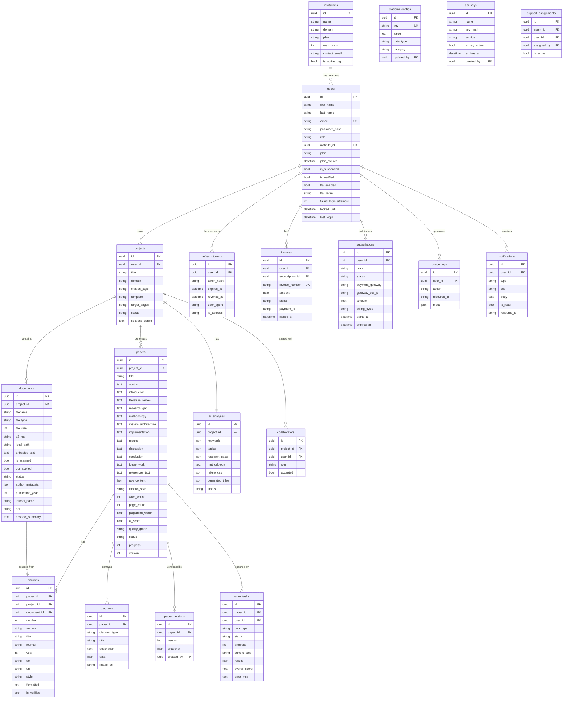

# 08 — Database Documentation

> **Back to Index**: [00_index.md](00_index.md)

---

## 8.1 ER Diagram



---

## 8.2 Table Reference

### `users`
Core identity and authorization table.

| Column | Type | Notes |
|--------|------|-------|
| `id` | UUID PK | Cryptographically secure, prevents IDOR |
| `email` | VARCHAR(255) | Unique, indexed |
| `password_hash` | VARCHAR(512) | PBKDF2-SHA256 via Werkzeug |
| `role` | VARCHAR(50) | `student/professor/phd/admin/super_admin/marketing/support_agent` |
| `institute_id` | UUID FK | NULL = individual user |
| `plan` | VARCHAR(30) | `free/starter/pro/institution` |
| `tfa_secret` | VARCHAR(32) | pyotp TOTP secret |
| `failed_login_attempts` | INT | Lockout counter (resets on success) |
| `locked_until` | TIMESTAMP | NULL = not locked |
| `deleted_at` | TIMESTAMP | NULL = active (soft delete) |

**Lifecycle**: Created on registration. Soft-deleted by admin. Hard-deleted only for GDPR "right to erasure" (future feature).

---

### `projects`
Research project container. The `id` UUID doubles as the Pinecone namespace.

| Column | Type | Notes |
|--------|------|-------|
| `id` | UUID PK | Also the Pinecone namespace: `project_<id>` |
| `user_id` | UUID FK | Owner |
| `citation_style` | VARCHAR(20) | `IEEE/APA/MLA/Chicago` |
| `template` | VARCHAR(50) | `IEEE Conference/Springer/Elsevier/...` |
| `sections_config` | JSON | Custom section definitions |
| `status` | VARCHAR(30) | `draft/processing/generating/completed/failed` |

---

### `documents`
Uploaded reference files.

| Column | Type | Notes |
|--------|------|-------|
| `extracted_text` | TEXT | Full plain-text content (used for RAG, plagiarism) |
| `is_scanned` | BOOL | PDF was scanned image (OCR was needed) |
| `ocr_applied` | BOOL | OCR was actually applied |
| `status` | VARCHAR(20) | `uploaded/processing/done/embedded/error` |
| `s3_key` | VARCHAR(512) | AWS S3 object key |
| `local_path` | VARCHAR(512) | Local filesystem path |
| `author_metadata` | JSON | Extracted author list `[{name, affiliation}]` |
| `doi` | VARCHAR(255) | Extracted DOI |

**Trigram index**: PostgreSQL `pg_trgm` extension is used on `extracted_text` for fuzzy text matching in the plagiarism scan. The trigram similarity query is: `similarity(extracted_text, :query) > 0.02`.

---

### `papers`
The generated research paper. Each standard section is its own `TEXT` column for direct SQL access.

| Column | Type | Notes |
|--------|------|-------|
| `raw_content` | JSON | `{section_key: raw_text_with_uuids}` — stores cite/diagram tags |
| `citation_style` | VARCHAR(20) | Applied during export |
| `plagiarism_score` | FLOAT | 0-100, set after scan completion |
| `ai_score` | FLOAT | 0-100, set after AI detection |
| `progress` | INT | 0-100, updated during generation |
| `current_section` | VARCHAR(60) | Section being generated ("methodology") |
| `version` | INT | Incremented on each save |
| `is_flagged` | BOOL | Admin/super_admin flag |

---

### `scan_tasks`
Tracks async plagiarism scan progress.

| Column | Type | Notes |
|--------|------|-------|
| `status` | VARCHAR(20) | `pending/processing/completed/failed` |
| `progress` | INT | 0-100 |
| `current_step` | VARCHAR(100) | Human-readable step name ("Semantic Analysis...") |
| `results` | JSON | Full scan results including flagged sentences |
| `overall_score` | FLOAT | Final plagiarism percentage |

---

### `usage_logs`
Token usage and cost tracking per API call.

| Column | Type | Notes |
|--------|------|-------|
| `action` | VARCHAR(50) | `api_token_usage/paper_generate/export/...` |
| `meta` | JSON | `{api_name, model, tokens_in, tokens_out, cost_usd, cost_inr, latency_ms}` |

---

### `platform_configs`
Key-value store for super admin platform settings.

| Column | Type | Notes |
|--------|------|-------|
| `key` | VARCHAR(100) | Unique setting name |
| `data_type` | VARCHAR(20) | `string/int/bool/json` |
| `category` | VARCHAR(50) | Groups related settings |

---

## 8.3 BaseModel — Common Fields (All Tables)

```python
id         UUID PK   (uuid4, cryptographically secure)
created_at TIMESTAMP (server_default=func.now(), timezone=True)
updated_at TIMESTAMP (auto-updates on save, timezone=True)
deleted_at TIMESTAMP (NULL = active, non-NULL = soft-deleted)
```

All models inherit these. No table has a plain integer `id`.

---

## 8.4 Indexes

| Table | Column | Index Type | Purpose |
|-------|--------|-----------|---------|
| `users` | `email` | B-tree UNIQUE | Login lookup |
| `users` | `institute_id` | B-tree | Admin scoping |
| `refresh_tokens` | `user_id` | B-tree | Session lookup |
| `refresh_tokens` | `token_hash` | B-tree | Token verification |
| `support_assignments` | `agent_id` | B-tree | RLS policy |
| `support_assignments` | `user_id` | B-tree | RLS policy |
| `documents` | `extracted_text` | GiST (pg_trgm) | Trigram fuzzy search |

---

## 8.5 Soft Delete Policy

**No hard deletes in production** (except GDPR requests). Records are soft-deleted by setting `deleted_at = now()`.

The `is_active` property on `BaseModel` returns `deleted_at is None`.

For `User`, `is_active` is overridden to also check `is_suspended`:
```python
@property
def is_active(self):
    return self.deleted_at is None and not self.is_suspended
```
