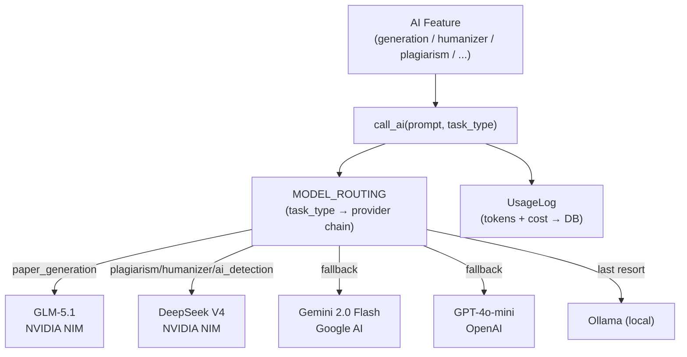

# 09 — AI Architecture

> **Back to Index**: [00_index.md](00_index.md)

---

## 9.1 Architecture Overview

All AI features in ResearchAI share a single **provider waterfall router** (`utils/ai_router.py`). No feature calls any AI provider directly — they all call `call_ai(prompt, task_type=...)`, which selects the appropriate provider based on feature-specific routing config, circuit breaker state, and availability.



---

## 9.2 Paper Generation

**Module**: `paper_genration/generation.py`  
**Celery Task**: `tasks/paper_tasks.py`  
**Task Type**: `paper_generation`  
**Primary Model**: GLM-5.1 (via NVIDIA NIM)  
**Fallback Chain**: Gemini → OpenAI → Ollama

### Prompt Flow

```
For each section:
  1. Pinecone.query(section_query, namespace=project_<id>, top_k=5*3)
  2. Diversify: max 2 chunks/doc, min 3 sources
  3. Filter: min similarity score 0.20
  4. Build grounded context string with <source id="doc_id"> tags
  5. System prompt: "You are a senior academic ghostwriter..."
  6. User prompt: "Write {section} section using this context: {context}"
  7. call_ai(prompt, task_type="paper_generation", max_tokens=1500)
  8. Strip markdown fences, clean output
  9. Save to Paper.<section>
```

### Section Instructions (hardcoded)
Each of the 11 sections has a dedicated instruction string specifying:
- Target word count range
- What to cover (structure, comparisons, etc.)
- What NOT to do (e.g., "no flat Author A says... summaries")

### Token Budget
- Max tokens per section: `1500`
- GLM timeout: `90s`
- Typical section: 400-600 words, ~800-1200 tokens output

---

## 9.3 RAG System

**Module**: `utils/pinecone_search.py`  
**Embedding Model**: SentenceTransformer `all-MiniLM-L6-v2` (384-dim local)  
**Vector DB**: Pinecone `researchai-dev` index  
**Isolation**: Per-project namespaces `project_<uuid>` + metadata filter

### Retrieval Parameters
- `top_k`: Retrieves `top_k * 3` candidates, filters to `top_k` after diversification
- `MIN_RAG_SIMILARITY`: `0.20` — chunks below this cosine threshold are discarded
- Diversification: max 2 chunks per source document

---

## 9.4 Citation Engine

**Module**: `utils/citation_processor.py`, `paper_genration/references.py`

During generation, the system discovers citation opportunities:
1. Chunks returned from Pinecone carry `doc_id` in metadata
2. `document_id` → `Citation` record → formatted reference string
3. Inline placeholder: `[[cite:doc_uuid]]` inserted in generated text
4. During export/render: placeholder replaced with formatted citation `[1]` / `(Author, 2020)`

**Styles supported**: IEEE, APA, MLA, Chicago  
**Fallback**: If citation not found → placeholder silently removed

---

## 9.5 AI Humanizer

**Module**: `utils/ai_humanizer.py`  
**Task Type**: `humanizer`  
**Primary Model**: DeepSeek V4-Pro (via NVIDIA NIM) — pro model used for better quality  
**Fallback**: Gemini  
**Max Tokens**: 2048

### 4-Phase Pipeline

| Phase | What It Does | Always Runs? |
|-------|-------------|--------------|
| **Phase 1: Pattern Removal** | Regex-replace 30+ AI phrases ("Furthermore" → "Also"), inject contractions | ✅ Always |
| **Phase 2: Burstiness Control** | Split long uniform sentences, merge orphans, vary length | Medium + High intensity |
| **Phase 3: LLM Deep Rewrite** | Forensic humanization prompt targeting burstiness, vocabulary, predicability | ✅ Always |
| **Phase 4: Word Diff** | Token-level diff of original vs humanized for annotation | ✅ Always |

**Self-refinement**: After LLM rewrite, the system scores the AI probability of the result. If the score is worse than the pre-LLM text, the pre-LLM version is returned ("keep best").

**Citation preservation**: `[[cite:UUID]]` tags are protected before transformation and restored after.

---

## 9.6 AI Detection

**Module**: `utils/ai_detector.py`, `utils/ai_ensemble.py`, `utils/ai_signals.py`  
**Task Type**: `ai_detection`  
**Primary Model**: DeepSeek V4-Flash  
**Signal-First Architecture** (saves expensive LLM calls for obvious cases)

### Detection Layers

**Layer 1 — Statistical Forensics** (always runs):

| Signal | How It Works |
|--------|-------------|
| Burstiness | `std(sentence_lengths) / mean(sentence_lengths)` — AI writes uniform lengths |
| Lexical Diversity | Type-Token Ratio (unique words / total words) |
| Vocabulary Richness | Hapax legomena ratio (words appearing exactly once) |
| Predictability | Average words/sentence + low-variance penalty |
| Punctuation Diversity | Human writing uses more varied punctuation |
| Avg Word Length | AI tends to use longer, more formal words |
| AI Pattern Count | Count of 10 known AI writing patterns |

**Layer 2 — Signal-First Bypass** (avoids LLM for clear cases):
- `stat_score ≤ 15` → classify as Human, skip LLM
- `stat_score ≥ 85` → classify as AI, skip LLM  
- `15 < stat_score < 85` → call LLM classifier

**Layer 3 — LLM Zero-Shot Classifier** (borderline only):
```
System: You are a forensic AI text classifier...
User: Analyze this text and return JSON: {is_ai_generated: bool, confidence: 0-100, reasoning: str}
```

**Layer 4 — Ensemble Aggregation** (`ai_ensemble.py`):
```
final_score = (stat_score * 0.40) + (llm_score * 0.60)
```

### Output Schema
```json
{
  "overall_score": 78,
  "classification": "AI-generated",
  "confidence": "high",
  "mode": "hybrid",
  "llm_available": true,
  "llm_called": true,
  "signal_breakdown": { "burstiness": 82, "lexical_diversity": 71, ... },
  "sentence_analysis": [{"text": "...", "score": 85, "is_ai": true}, ...],
  "statistics": { "words": 312, "sentences": 18, "paragraphs": 4 }
}
```

---

## 9.7 Plagiarism Engine

**Module**: `utils/plagiarism_engine.py`, `utils/semantic_engine.py`  
**Task**: `tasks/plagiarism_tasks.py` (Celery chord)  
**AI Task Type**: `plagiarism`

See full details in [Plagiarism Pipeline](14_plagiarism_pipeline.md).

---

## 9.8 Paraphraser

**Module**: `utils/paraphraser_engine.py`, `utils/paraphrase_manager.py`  
**Task Type**: `paraphraser`  
**Primary Model**: DeepSeek V4-Flash  
**Fallback**: Gemini → OpenAI

### Prompt Flow
```
System: You are an academic paraphrasing assistant. 
        Preserve all citation tags [[cite:UUID]].
        Maintain academic tone and semantic meaning.
        
User: Paraphrase this sentence: "{sentence}"
```

**Citation preservation**: Citations stripped before LLM call, restored by position after.

---

## 9.9 Diagram Studio AI

**Module**: `routes/paper.py` (diagram endpoints)

### Opportunity Scanning
**Model**: DeepSeek V4-Flash via direct NVIDIA API (`call_diagram_ai()`)  
**Fallback**: `call_ai()` waterfall  
**Batch processing**: Paragraphs split into chunks of 5, run concurrently via `ThreadPoolExecutor(max_workers=5)`

**Prompt**: For each batch of paragraphs:
```
Identify which paragraphs would benefit from a diagram.
Return JSON array: [{paragraph_id, confidence, recommended_type, reason, suggested_title}]
```

### Diagram Generation

**SVG/Mermaid diagrams** (Flowchart, Sequence, Mind Map):
- Model: `qwen/qwen2-72b-instruct` via NVIDIA
- Returns raw Mermaid.js code string
- Rendered client-side via `mermaid.js` library

**AI Illustration** (pixel images):
- Model: NVIDIA Stable Diffusion XL
- API: `https://ai.api.nvidia.com/v1/genai/stabilityai/stable-diffusion-xl`
- Returns base64-encoded PNG: `data:image/png;base64,...`
- Resolution: 1024×1024

---

## 9.10 Document Analysis

**Module**: `paper_genration/analysis.py`  
**Purpose**: Extract structured metadata from uploaded document text

Extracts using LLM:
- Authors and affiliations
- Publication year
- Journal name
- DOI
- Abstract summary
- Keywords and research topics
- Research gaps

This data is stored in the `Document` model and used for:
- Research library display
- Citation pre-population
- Analysis tab results
