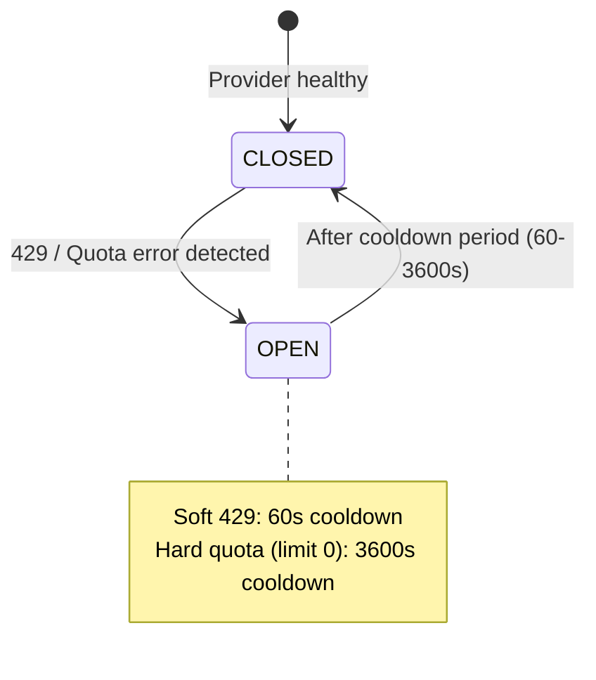
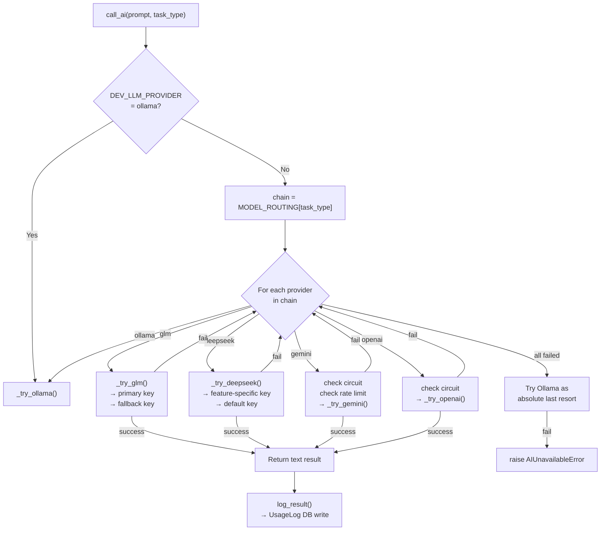

# 10 — Multi-Model Router

> **Back to Index**: [00_index.md](00_index.md)

---

## 10.1 Overview

`utils/ai_router.py` is the **central AI reliability layer** for all LLM calls. It provides:

1. **Multi-provider waterfall routing** — tries providers in configured priority order
2. **Per-provider circuit breakers** — auto-disables failing providers
3. **Gemini rate limiter** — sliding-window token bucket (10 RPM/worker)
4. **Feature-specific API keys** — different API keys per task type
5. **Cost tracking** — logs token usage + USD/INR cost to `UsageLog`
6. **Safe failure** — raises `AIUnavailableError` only when ALL providers are down

---

## 10.2 Provider Routing Table

| Feature / Task Type | Primary | Fallback 1 | Fallback 2 | Last Resort |
|--------------------|---------|-----------|-----------|-------------|
| `paper_generation` | GLM-5.1 | Gemini | OpenAI | Ollama |
| `plagiarism` | DeepSeek V4-Flash | Gemini | — | Ollama |
| `paraphraser` | DeepSeek V4-Flash | Gemini | OpenAI | Ollama |
| `humanizer` | DeepSeek V4-Pro | Gemini | — | Ollama |
| `humanize_batch` | DeepSeek V4-Pro | Gemini | — | Ollama |
| `ai_detection` | DeepSeek V4-Flash | Gemini | — | Ollama |
| `generic` | DeepSeek V4-Flash | Gemini | OpenAI | Ollama |

**Override via environment**:
```env
PAPER_GEN_PRIMARY=glm
PAPER_GEN_FALLBACKS=gemini,openai
```

---

## 10.3 Circuit Breaker Architecture

Each provider has its own `_CircuitBreaker` instance:

```python
_gemini_breaker   = _CircuitBreaker(open_seconds=60,   label="Gemini")
_openai_breaker   = _CircuitBreaker(open_seconds=120,  label="OpenAI")
_deepseek_breaker = _CircuitBreaker(open_seconds=60,   label="DeepSeek")
_glm_breaker      = _CircuitBreaker(open_seconds=60,   label="GLM")
```

### State Machine



### Quota Error Detection

```python
def _is_quota_error(exc):
    msg = str(exc).lower()
    return any(kw in msg for kw in ("429", "resource_exhausted", "quota", "rate limit", "ratelimit"))

def _is_hard_quota_exhausted(exc):
    msg = str(exc).lower()
    return "limit: 0" in msg or "insufficient_quota" in msg or "exceeded your current quota" in msg
```

- **Soft 429** (per-minute rate limit): Circuit opens for 60 seconds
- **Hard quota** (daily limit exhausted): Circuit opens for **1 hour** (3600s)

---

## 10.4 Gemini Rate Limiter

**Problem**: Gemini free tier allows only 10 RPM per API key.  
**Solution**: Sliding-window token bucket (`_GeminiLimiter`) per worker process.

```python
class _GeminiLimiter:
    def __init__(self, max_rpm: int):
        self._max_rpm = 10
        self._window  = 60.0      # seconds
        self._timestamps = []
        self._lock = threading.Lock()

    def is_allowed(self) -> bool:
        now = time.monotonic()
        with self._lock:
            # Evict old timestamps
            cutoff = now - self._window
            self._timestamps = [t for t in self._timestamps if t > cutoff]
            if len(self._timestamps) < self._max_rpm:
                self._timestamps.append(now)
                return True
            return False
```

**Note**: This is **per-worker** (each Celery worker process has its own limiter state). Cross-worker coordination is NOT implemented — each worker independently tracks its Gemini usage. The real-world effective RPM = `MAX_GEMINI_RPM × num_workers`.

---

## 10.5 Feature-Specific API Keys

DeepSeek allows different API keys per feature to enable cost separation and per-feature quota management:

| Task Type | Environment Variable |
|-----------|---------------------|
| `plagiarism` | `DEEPSEEK_PLAGIARISM_API_KEY` |
| `paraphraser` | `DEEPSEEK_PARAPHRASER_API_KEY` |
| `humanizer` | `DEEPSEEK_HUMANIZER_API_KEY` |
| `ai_detection` | `DEEPSEEK_AI_DETECTION_API_KEY` |
| `generic` / fallback | `DEEPSEEK_DEFAULT_API_KEY` |

**Key resolution logic**:
```python
key_env = DEEPSEEK_KEY_MAP.get(task_type, "DEEPSEEK_DEFAULT_API_KEY")
api_key = os.environ.get(key_env) or os.environ.get("DEEPSEEK_DEFAULT_API_KEY")
```

If the feature-specific key is missing, it falls back to the default key.

**GLM primary + fallback key**:
```python
primary_key  = os.environ.get("GLM_API_KEY")
fallback_key = os.environ.get("GLM_API_KEY_FALLBACK") or os.environ.get("GLM_FALLBACK_API_KEY")
```
GLM tries primary first, then fallback — before the circuit breaker trips.

---

## 10.6 Model Routing Call Flow



---

## 10.7 Cost Tracking

After every successful call, `log_result()` writes a `UsageLog` entry:

```python
UsageLog(
    user_id=get_current_user_id(),
    action="api_token_usage",
    meta={
        "api_name": "deepseek",
        "model": "deepseek-ai/deepseek-v4-flash",
        "task_type": "plagiarism",
        "tokens_in": 1243,
        "tokens_out": 387,
        "total_tokens": 1630,
        "cost_usd": 0.000282,    # (1243/1M * $0.14) + (387/1M * $0.28)
        "cost_inr": 0.0238,      # cost_usd * 84.5
        "latency_ms": 892,
        "fallback_reason": "glm_failed_or_skipped"
    }
)
```

**Model pricing table** (`config.py`):

| Model | Input $/1M tokens | Output $/1M tokens |
|-------|-------------------|--------------------|
| GLM-5.1 | $0.30 | $2.50 |
| DeepSeek V4-Flash | $0.14 | $0.28 |
| DeepSeek V4-Pro | $0.55 | $2.20 |
| Gemini 2.0 Flash | $0.10 | $0.40 |
| GPT-4o-mini | $0.15 | $0.60 |
| Ollama (local) | $0.00 | $0.00 |

---

## 10.8 Dev Mode Override

```env
DEV_LLM_PROVIDER=ollama
```

Setting this environment variable in `.env` forces all AI calls directly to Ollama, bypassing all cloud providers. Useful for:
- Local development without API keys
- Testing without incurring costs
- Offline development

**Note**: The `app.py` includes `os.environ.pop("DEV_LLM_PROVIDER", None)` at startup to prevent a stuck terminal env var from causing cloud bypass in production by accident.

---

## 10.9 Provider Request Details

### GLM (NVIDIA NIM)
```python
client = openai.OpenAI(api_key=glm_key, base_url="https://open.bigmodel.cn/api/paas/v4/")
response = client.chat.completions.create(
    model="glm-5.1",
    max_tokens=1500,
    temperature=0.7,  # paper_generation
    messages=[{"role":"system","content":"..."}, {"role":"user","content":"..."}]
)
```

### DeepSeek (NVIDIA NIM)
```python
client = openai.OpenAI(api_key=ds_key, base_url="https://integrate.api.nvidia.com/v1")
response = client.chat.completions.create(
    model="deepseek-ai/deepseek-v4-flash",
    extra_body={"chat_template_kwargs": {"thinking": False}},  # disable chain-of-thought
    ...
)
```

### Gemini
```python
import google.generativeai as genai
genai.configure(api_key=api_key)
model = genai.GenerativeModel("gemini-2.0-flash", system_instruction=sys_prompt)
response = model.generate_content(prompt, generation_config=GenerationConfig(max_output_tokens=256))
```

### Ollama
```python
requests.post(f"{base_url}/api/chat", json={
    "model": "llama3.1:8b",
    "stream": False,
    "messages": [...],
    "options": {"num_predict": max_tokens}
}, timeout=180)
```
