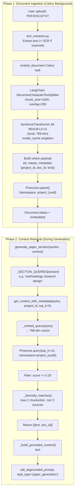

# 11 — RAG Pipeline

> **Back to Index**: [00_index.md](00_index.md)

---

## 11.1 Overview

The RAG (Retrieval-Augmented Generation) pipeline is the backbone of all paper generation in ResearchAI. It ensures that generated content is **grounded in the user's own uploaded documents** rather than hallucinated by the LLM.

The pipeline has two phases:
- **Phase 1 (Ingestion)**: Upload → Extract → Chunk → Embed → Upsert to Pinecone
- **Phase 2 (Retrieval)**: Section generation → Query → Retrieve → Inject into prompt

---

## 11.2 Complete RAG Flow



---

## 11.3 Ingestion Details

### Text Extraction (`utils/text_extractor.py`)
- **PDF**: PyPDF2 or pdfplumber for text-layer PDFs
- **Scanned PDF**: pytesseract (Tesseract OCR) for image-only PDFs
- **DOCX**: python-docx
- **TXT**: Direct read
- `is_scanned` and `ocr_applied` flags stored on Document model

### Chunking (`tasks/embed_document.py`)
```python
splitter = RecursiveCharacterTextSplitter(
    chunk_size=1000,           # ~250 words
    chunk_overlap=200,         # 50-word overlap for continuity
    length_function=len,
    separators=["\n\n", "\n", ". ", " ", ""]
)
```
Chunk overlap ensures sentences that span chunk boundaries are captured in both chunks, preventing context loss at boundaries.

### Embedding (`utils/model_cache.py`)
```python
# Process-level singleton — loaded ONCE per worker
_model_singleton = SentenceTransformer("all-MiniLM-L6-v2", device="cpu")

def get_embedding_model():
    return _model_singleton
```
All chunks are encoded in a single batch call: `model.encode(chunks).tolist()`. This is significantly faster than encoding one chunk at a time.

### Pinecone Upsert (Idempotency Guard)
```python
# Step 1: Delete stale vectors from any previous (possibly crashed) attempt
index.delete(
    filter={"document_id": {"$eq": document_id}},
    namespace=f"project_{project_id}"
)

# Step 2: Upsert in batches of 50
for i in range(0, len(vectors), 50):
    index.upsert(vectors=vectors[i:i+50], namespace=namespace)
```

The delete-before-upsert pattern ensures **exactly-once semantics** even when Celery retries a crashed task.

---

## 11.4 Multi-Tenant Isolation (Defense in Depth)

The system uses two layers of isolation to prevent cross-tenant data access:

### Layer 1 — Namespace Isolation (Structural)
Every project's vectors are physically stored in a separate Pinecone namespace: `project_<project_uuid>`. A query to namespace A **cannot physically return vectors from namespace B** — this is enforced by Pinecone's storage architecture.

### Layer 2 — Metadata Filter (Safety Net)
Even within a namespace query, a metadata filter is applied:
```python
# Note: current implementation retrieves by namespace only,
# the metadata filter is the secondary guard via the unique namespace derivation
namespace = f"project_{project_id}"
```
The `project_id` and `user_id` are stored in every vector's metadata, enabling secondary filtering if needed.

### Security Guards
```python
# In _upsert_vectors():
if project_id is None:
    raise ValueError("SECURITY: project_id is None — refusing to upsert without namespace")

# In get_context():
if project_id is None:
    logger.error("SECURITY: get_context called with project_id=None")
    return ""
```

---

## 11.5 Retrieval Details

### Query Embedding
Same model as ingestion (`all-MiniLM-L6-v2`), same process-level singleton cache. Query is encoded to a 768-dim vector.

### Diversification Algorithm (`_diversify_matches`)
```
1. Group all matches by document_id
2. Round 1: Pick the highest-scored chunk from each unique document
3. Round 2: Pick the second-best chunk from each document (max 2 per doc)
4. Fill remaining slots from "unknown" documents
5. Re-sort by original ranking
```

This ensures that context from multiple source documents is used — avoiding over-representation of one highly-similar document.

### Section-Specific Queries
Each paper section uses a tuned semantic query to retrieve the most relevant context:

| Section | RAG Query |
|---------|----------|
| `abstract` | "research objectives methods results conclusions summary" |
| `introduction` | "background motivation problem statement research context" |
| `literature_review` | "related work previous studies comparative analysis state of the art" |
| `research_gap` | "limitations gaps unsolved problems limitations of existing methods" |
| `methodology` | "methodology research design experimental setup data collection analysis methods simulation model" |
| `system_architecture` | "system architecture components design modules data flow pipeline" |
| `implementation` | "implementation tools libraries frameworks hardware software environment setup" |
| `results` | "results performance accuracy metrics benchmark evaluation comparison" |
| `discussion` | "discussion interpretation findings implications limitations constraints" |
| `conclusion` | "conclusion contributions summary key findings impact" |
| `future_work` | "future work improvements extensions open problems next steps" |

---

## 11.6 GDPR Vector Cleanup

When a document or project is deleted, its Pinecone vectors are asynchronously purged:

### Document-level cleanup (`tasks/embed_document.delete_document_vectors`)
```python
index.delete(
    filter={"document_id": {"$eq": document_id}},
    namespace=f"project_{project_id}"
)
```
Purges only vectors belonging to the deleted document. Other documents in the same project are untouched.

### Project-level cleanup (`tasks/embed_document.delete_all_project_vectors`)
```python
index.delete(delete_all=True, namespace=f"project_{project_id}")
```
Wipes the entire namespace. All documents in the project are purged simultaneously.

Both tasks have `max_retries=3` and `default_retry_delay=15` seconds. If all retries fail, a `GDPR ALERT` critical log is emitted for manual intervention.

---

## 11.7 Monitoring & Observability

The retrieval function logs detailed statistics on every call:
```
RETRIEVER_STATS | namespace='project_abc' | query='methodology research design' 
| retrieved=15 | kept=9 | filtered=6 | min_score=0.1234 | max_score=0.8901
```

Alert logged when all retrieved chunks are below threshold:
```
WARNING: All retrieved document chunks (15) were below MIN_RAG_SIMILARITY 
threshold (0.20) in namespace='project_abc'. Max score was 0.1876
```

This helps diagnose cases where:
- Documents are in a different language than the query
- Documents are too technical/specialized for the embedding model
- The project namespace is empty (documents not yet embedded)
