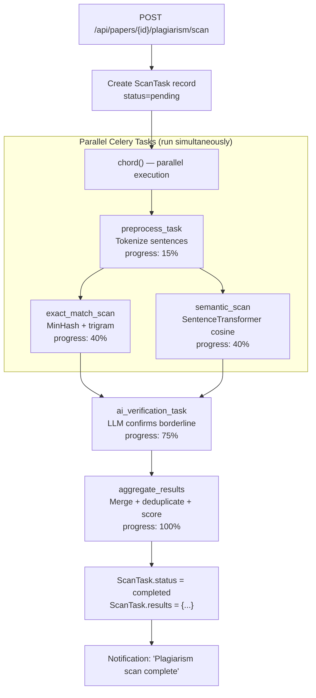

# 14 — Plagiarism Pipeline

> **Back to Index**: [00_index.md](00_index.md)

---

## 14.1 Overview

ResearchAI implements a **4-layer ensemble plagiarism detection system** that runs as an async Celery chord pipeline. It combines classical text fingerprinting with semantic similarity and AI-based verification to minimize both false positives and false negatives.

---

## 14.2 Architecture: Celery Chord Pipeline



---

## 14.3 Step 1: Preprocessing (`preprocess_task`)

```python
sentences = [s.strip() for s in re.split(r'(?<=[.!?])\s+', text.strip()) if s.strip()]
return {
    "clean_text": text.strip(),
    "sentences": sentences,
    "word_count": len(text.split()),
    "char_count": len(text)
}
```

Also normalizes sentences via `normalize_sentence()`:
- Remove `[[uuid]]` citation markers
- Remove `[1]` numbered citations
- Remove `(Author, 2020)` parenthetical citations
- Collapse whitespace

Progress: **15%**

---

## 14.4 Step 2a: Exact Match Scan (`exact_match_scan`)

### Candidate Retrieval (PostgreSQL Trigrams)
```sql
SELECT id, filename, extracted_text, 
       similarity(extracted_text, :q) as sim
FROM documents
WHERE project_id = :pid
  AND extracted_text IS NOT NULL
  AND similarity(extracted_text, :q) > 0.02
ORDER BY sim DESC
LIMIT 20
```

Uses PostgreSQL `pg_trgm` extension for **trigram similarity** — character 3-gram overlap between the paper text and each document's extracted text. Filters to 20 most similar candidates for deeper analysis.

### MinHash Fingerprinting

For each candidate:
```python
engine = PlagiarismEngine()
query_fp = engine.get_fingerprint(clean_text)      # Set of word n-grams
query_sig = engine.compute_minhash_signature(query_fp)  # MinHash signature

for candidate in candidates:
    src_fp = engine.get_fingerprint(candidate.extracted_text)
    src_sig = engine.compute_minhash_signature(src_fp)
    
    # Jaccard similarity via MinHash approximation
    similarity = compute_jaccard(query_sig, src_sig)
    
    if similarity > 0.15:  # Threshold for flagging
        flagged_sentences.append({
            "sentence": sentence,
            "source_doc": candidate.filename,
            "similarity": similarity
        })
```

**MinHash**: A locality-sensitive hashing technique that approximates Jaccard set similarity in O(1) space. The fingerprint is a set of word n-grams (shingles). Two texts with similar n-gram sets have high Jaccard similarity → likely plagiarized.

Progress: **40%**

---

## 14.5 Step 2b: Semantic Scan (`semantic_scan`)

```python
from utils.semantic_engine import SemanticEngine
engine = SemanticEngine()

for sentence in sentences:
    for candidate in candidate_texts:
        similarity = engine.compute_similarity(sentence, candidate)
        if similarity > 0.75:  # Semantic similarity threshold
            flagged_sentences.append({...})
```

**SemanticEngine** uses the same SentenceTransformer (`all-MiniLM-L6-v2`) to compute cosine similarity between sentence embeddings. This catches **paraphrase plagiarism** that exact matching misses — sentences reworded but semantically identical.

**Key difference from exact match**:
- Exact: "The results show accuracy of 95%" → detects copies
- Semantic: "Our system achieves 95% accuracy on the test set" → also detects paraphrase

Progress: **40%** (runs concurrently with exact match)

---

## 14.6 Step 3: AI Verification (`ai_verification_task`)

For sentences flagged by either exact or semantic scan, the LLM acts as a verifier to:
- Confirm genuine plagiarism (not coincidental phrase match)
- Identify false positives (e.g., common academic phrases)
- Classify severity (verbatim vs. mosaic vs. paraphrase)

```python
prompt = f"""
Analyze whether this detected match represents actual plagiarism:

Original sentence: "{sentence}"
Source text: "{source_excerpt}"
Similarity score: {score}

Determine:
1. Is this genuine plagiarism? (yes/no)
2. Type: verbatim | paraphrase | mosaic | coincidental
3. Confidence: high | medium | low
4. Recommended action: flag | review | dismiss

Return JSON: {{is_plagiarism: bool, type: str, confidence: str, action: str}}
"""
result = call_ai(prompt, task_type="plagiarism", max_tokens=256)
```

This step is **critical for quality** — it removes false positives from common academic phrases like "literature review", "methodology section", "as shown in Figure 1" that appear in many papers.

Progress: **75%**

---

## 14.7 Step 4: Result Aggregation (`aggregate_results`)

```python
def aggregate_results(exact_results, semantic_results, ai_results):
    all_flagged = []
    
    # Merge and deduplicate by sentence
    seen_sentences = set()
    for result in exact_results + semantic_results:
        normalized = normalize_sentence(result["sentence"])
        if normalized not in seen_sentences and ai_results.get(normalized, {}).get("is_plagiarism", True):
            all_flagged.append(result)
            seen_sentences.add(normalized)
    
    # Calculate overall score
    total_sentences = len(all_sentences)
    flagged_count = len(all_flagged)
    overall_score = (flagged_count / total_sentences * 100) if total_sentences > 0 else 0.0
    
    return {
        "overall_score": sanitize_score(overall_score),
        "flagged_sentences": all_flagged,
        "total_sentences": total_sentences,
        "flagged_count": flagged_count
    }
```

**`sanitize_score()`** (`utils/score_safety.py`): Clamps the score to [0, 100], rounds to 2 decimals, handles NaN/Infinity.

Progress: **100%**

---

## 14.8 Results Schema

```json
{
  "overall_score": 14.7,
  "total_sentences": 120,
  "flagged_count": 18,
  "flagged_sentences": [
    {
      "sentence": "The proposed system uses deep learning...",
      "source_doc": "reference_paper.pdf",
      "similarity": 0.87,
      "match_type": "semantic",
      "ai_verified": true,
      "type": "paraphrase",
      "confidence": "high",
      "action": "flag"
    }
  ]
}
```

---

## 14.9 Scan Status Polling

Frontend polls `GET /api/papers/<id>/plagiarism/status` every 3 seconds:

```javascript
const poll = setInterval(async () => {
    const status = await apiFetch(`/papers/${paperId}/plagiarism/status`);
    updateProgressBar(status.progress);
    updateStepLabel(status.current_step);
    
    if (status.status === 'completed') {
        clearInterval(poll);
        renderResults(status.results);
    }
}, 3000);
```

---

## 14.10 Standalone Plagiarism Scanner

**Route**: `routes/standalone_plagiarism.py`  
**Task**: `tasks/standalone_plagiarism_tasks.py`  
**Screen**: `screenStandalonePlagiarism`

The standalone scanner allows users to paste any text and scan it against their uploaded documents, **without creating a paper first**. Same pipeline, same Celery chord, different entry point.

Use case: Check a paragraph written manually before inserting it into a paper.

---

## 14.11 `score_safety.py`

All plagiarism and AI detection scores pass through `sanitize_score()`:

```python
def sanitize_score(score: float) -> float:
    if score is None or math.isnan(score) or math.isinf(score):
        return 0.0
    return round(max(0.0, min(100.0, float(score))), 2)
```

This prevents edge cases (division by zero, empty text, API errors) from producing invalid scores that could confuse the UI or database.
