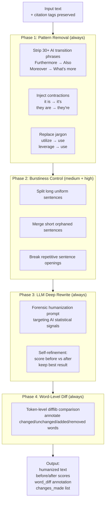

# 15 — Humanizer Pipeline

> **Back to Index**: [00_index.md](00_index.md)

---

## 15.1 Overview

The AI Humanizer transforms AI-generated text to read more like human-written academic prose. It uses a **4-phase approach** inspired by the QuillBot/Copyleaks humanization methodology, targeting the specific statistical signals that AI detection systems look for.

**Module**: `utils/ai_humanizer.py`  
**Task Type**: `humanizer`  
**Primary Model**: DeepSeek V4-Pro (higher quality model for better rewriting)  
**Fallback**: Gemini → Ollama

---

## 15.2 Four-Phase Architecture



---

## 15.3 Phase 1: AI Pattern Removal

30+ regex-based replacements targeting the most common AI writing patterns detected by tools like GPTZero, Turnitin, and Copyleaks:

### Transition Phrases
| AI Pattern | Human Replacement |
|-----------|------------------|
| `Furthermore,` | `Also,` |
| `Moreover,` | `What's more,` |
| `Additionally,` | `Plus,` |
| `Consequently,` | `As a result,` |
| `In conclusion,` | `To wrap up,` |
| `In summary,` | `In short,` |
| `It is important to note that` | `Note that` |
| `Therefore,` | `So,` |
| `Thus,` | `So,` |
| `Nevertheless,` | `Still,` |

### Formal Jargon
| AI Jargon | Human Alternative |
|-----------|------------------|
| `utilize` | `use` |
| `facilitate` | `help` |
| `leverage` | `use` |
| `multifaceted` | `complex` |
| `holistic` | `overall` |
| `robust` | `strong` |
| `paradigm` | `approach` |
| `synergy` | `combined effect` |
| `delve into` | `explore` |
| `shed light on` | `clarify` |

### Contractions (Academic Context — applied selectively)
```python
(r"\bit is\b", "it's"),
(r"\bthey are\b", "they're"),
(r"\bwe are\b", "we're"),
(r"\bcannot\b", "can't"),  # context-sensitive
```

---

## 15.4 Phase 2: Burstiness Control

**Burstiness** is the variation in sentence length. Human writing has high burstiness (short punchy sentences mixed with long detailed ones). AI writing has low burstiness (all sentences similar length ~18-22 words).

### Long Sentence Splitting
Sentences over a threshold (e.g., 45 words) are split at natural break points:
- ` which ` → sentence break
- ` where ` → sentence break
- ` while ` → sentence break

```python
if word_count > 45:
    split_points = [' which ', ' where ', ' while ', ', and ']
    for point in split_points:
        if point in sentence:
            parts = sentence.split(point, 1)
            return f"{parts[0]}. {parts[1].capitalize()}"
```

### Short Sentence Merging
Sentences under 5 words are merged with the following sentence to avoid choppy rhythm.

### Repetitive Opening Detection
If 3+ consecutive sentences start with the same word (e.g., "The", "This", "It"), the openings are rewritten by the LLM in Phase 3.

---

## 15.5 Phase 3: LLM Deep Rewrite

The forensic humanization prompt is the most powerful phase:

```
SYSTEM: You are a forensic academic writing humanizer.
Your task is to rewrite text to eliminate statistical AI writing patterns.

Target these specific issues:
1. BURSTINESS: Mix short punchy sentences (8-12 words) with longer detailed ones (20-35 words)
2. VOCABULARY: Replace formal Latinate words with simpler Anglo-Saxon alternatives
3. PREDICTABILITY: Add unexpected word choices, unusual phrasings, natural imprecisions
4. HEDGING: Add human uncertainty markers ("roughly", "about", "approximately")
5. PERSPECTIVE: Occasionally use first-person plural ("we found", "our results suggest")
6. CONTRACTIONS: Use contractions where natural

DO NOT change citations [[cite:UUID]]. DO NOT change technical terms.
DO NOT write a summary — rewrite the EXACT same ideas differently.

USER: Rewrite this academic text: {text}
```

**Self-refinement loop**:
```python
# Score the text before LLM rewrite
score_before = detect_ai_score(phase2_text)

# Call LLM
llm_result = call_ai(prompt, task_type="humanizer", max_tokens=2048)

# Score after
score_after = detect_ai_score(llm_result)

# Keep best result
if score_after < score_before:
    # LLM actually made it WORSE (higher AI score) — discard LLM result
    final_text = phase2_text
else:
    final_text = llm_result
```

---

## 15.6 Phase 4: Word-Level Diff

A token-level diff between the original and humanized text produces the annotation:

```python
import difflib

original_tokens = original_text.split()
humanized_tokens = humanized_text.split()

diff = difflib.SequenceMatcher(None, original_tokens, humanized_tokens)
word_diff = []

for opcode, i1, i2, j1, j2 in diff.get_opcodes():
    if opcode == 'equal':
        for w in original_tokens[i1:i2]:
            word_diff.append({"word": w, "type": "unchanged"})
    elif opcode == 'replace':
        for w in original_tokens[i1:i2]:
            word_diff.append({"word": w, "type": "removed"})
        for w in humanized_tokens[j1:j2]:
            word_diff.append({"word": w, "type": "added"})
    elif opcode == 'insert':
        for w in humanized_tokens[j1:j2]:
            word_diff.append({"word": w, "type": "added"})
    elif opcode == 'delete':
        for w in original_tokens[i1:i2]:
            word_diff.append({"word": w, "type": "removed"})
```

The frontend renders this diff with colored highlighting:
- **Green**: Added/changed words
- **Red**: Removed words
- **Gray**: Unchanged words

---

## 15.7 Citation Preservation

Before any phase, citations are extracted and protected:

```python
CITE_TAG_PATTERN = r'\[\[cite:[a-zA-Z0-9-]+\]\]'

def protect_citations(text):
    citations = re.findall(CITE_TAG_PATTERN, text)
    protected = text
    for i, c in enumerate(citations):
        protected = protected.replace(c, f"__CITE_{i}__", 1)
    return protected, citations

def restore_citations(text, citations):
    for i, c in enumerate(citations):
        text = text.replace(f"__CITE_{i}__", c, 1)
    return text
```

---

## 15.8 Output Schema

```python
{
    "original":           "The system leverages deep learning methodologies...",
    "humanized":          "Our system uses deep learning—which actually works surprisingly well...",
    "human_score_before": 12.3,    # 100 - AI-score before humanization
    "human_score_after":  78.6,    # 100 - AI-score after humanization
    "improvement":        66.3,    # Percentage points gained
    "word_diff": [
        {"word": "The",         "type": "removed"},
        {"word": "Our",         "type": "added"},
        {"word": "system",      "type": "unchanged"},
        ...
    ],
    "changes_made": [
        "Removed 8 AI transition phrases",
        "Applied 5 contractions",
        "Split 3 long sentences for burstiness",
        "LLM deep rewrite applied"
    ],
    "intensity": "medium",
    "error": null
}
```

---

## 15.9 Intensity Levels

| Level | Phase 1 | Phase 2 | Phase 3 LLM |
|-------|---------|---------|------------|
| **light** | ✅ Full | ❌ | ✅ (shorter prompt) |
| **medium** | ✅ Full | ✅ | ✅ (standard prompt) |
| **high** | ✅ Full | ✅ Aggressive | ✅ (stronger prompt, higher temp) |
