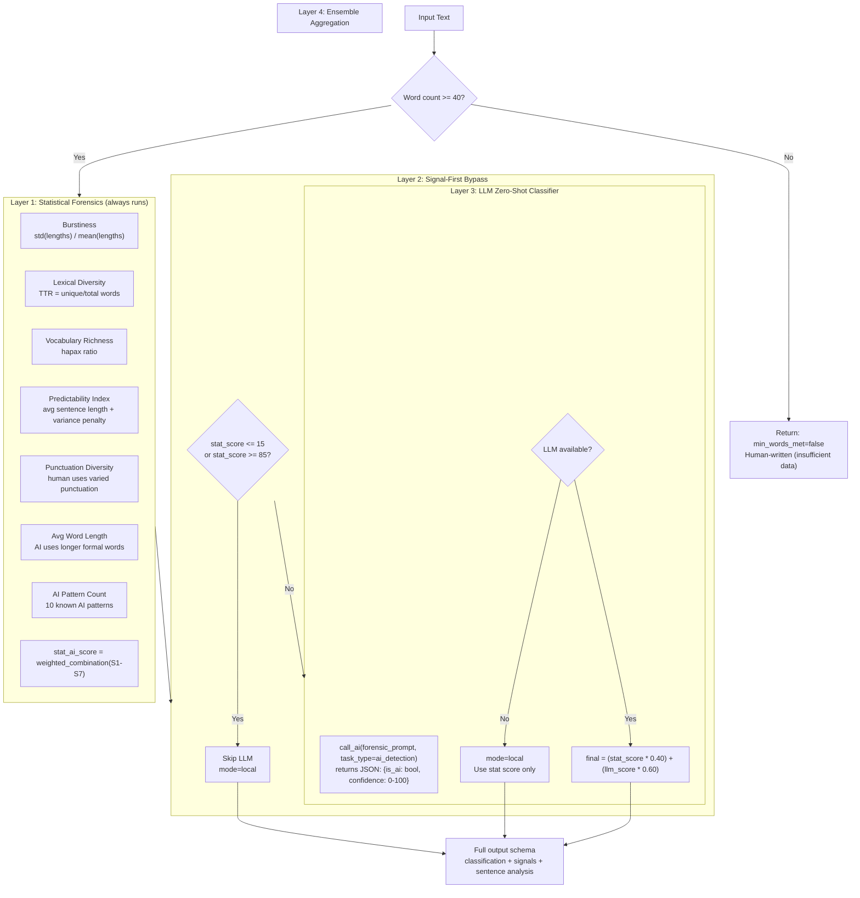

# 16 — AI Detection Pipeline

> **Back to Index**: [00_index.md](00_index.md)

---

## 16.1 Overview

The AI Detection engine uses a **signal-first architecture** that combines six statistical forensic signals with an optional LLM zero-shot classifier. Designed to mirror the approach used by Turnitin, GPTZero, and Copyleaks.

**Module**: `utils/ai_detector.py`, `utils/ai_ensemble.py`, `utils/ai_signals.py`  
**Task Type**: `ai_detection`  
**Primary Model**: DeepSeek V4-Flash  

---

## 16.2 Detection Architecture



---

## 16.3 Statistical Signals

### Signal 1: Burstiness
```python
sentence_lengths = [len(s.split()) for s in sentences]
burstiness = std(sentence_lengths) / mean(sentence_lengths)
# LOW burstiness → AI (uniform length sentences)
# HIGH burstiness → Human (varied length)
ai_score = max(0, 1 - burstiness) * 100
```

### Signal 2: Lexical Diversity (TTR)
```python
words = text.lower().split()
ttr = len(set(words)) / len(words)
# LOW TTR → AI (repetitive vocabulary)
# HIGH TTR → Human (rich vocabulary)
ai_score = max(0, 1 - (ttr * 1.5)) * 100
```

### Signal 3: Vocabulary Richness (Hapax Legomena)
```python
from collections import Counter
word_counts = Counter(words)
hapax = sum(1 for w, c in word_counts.items() if c == 1)
hapax_ratio = hapax / len(words)
# LOW hapax ratio → AI (words repeated frequently)
# HIGH hapax ratio → Human (diverse one-time words)
```

### Signal 4: Predictability Index
```python
avg_length = mean(sentence_lengths)
variance = std(sentence_lengths)
predictability = avg_length / (variance + 1)
# HIGH predictability → AI (consistent, predictable rhythm)
ai_score = min(100, predictability * 3)
```

### Signal 5: Punctuation Diversity
```python
punctuation_chars = "!?;:—–…()[]\"'"
unique_punct = len(set(c for c in text if c in punctuation_chars))
# LOW punctuation diversity → AI (mostly periods and commas)
ai_score = max(0, 1 - (unique_punct / 8)) * 100
```

### Signal 6: Average Word Length
```python
avg_word_len = mean([len(w) for w in words])
# HIGH avg word length → AI (prefers formal Latinate words)
ai_score = min(100, max(0, (avg_word_len - 4.5) * 25))
```

### Signal 7: AI Pattern Density
```python
AI_PATTERNS = [
    r"\b(moreover|furthermore|additionally|consequently|therefore|thus)\b",
    r"\b(it is (important|crucial|essential|worth noting))\b",
    r"\b(in (conclusion|summary|essence|other words))\b",
    r"\b(firstly|secondly|thirdly|finally)\b",
    r"\b(delve into|shed light on|nuanced|multifaceted|robust)\b",
    r"\b(leverag(e|ing)|utiliz(e|ing)|facilitat(e|ing))\b",
    r"\b(paradigm|holistic|synergy|ecosystem|landscape)\b",
    r"\b(it should be noted|it is worth noting)\b",
    r"\b(comprehensive(ly)?|extensive(ly)?|thorough(ly)?)\b",
    r"\b(as an? (AI|language model))\b",
]

pattern_count = sum(len(re.findall(p, text, re.I)) for p in AI_PATTERNS)
word_count = len(text.split())
pattern_density = pattern_count / (word_count / 100)  # per 100 words
ai_score = min(100, pattern_density * 15)
```

---

## 16.4 Signal-First Bypass Thresholds

```python
LOCAL_HUMAN_THRESHOLD = 15   # stat_score <= 15  → clearly human, skip LLM
LOCAL_AI_THRESHOLD    = 85   # stat_score >= 85  → clearly AI,    skip LLM
```

This optimization saves significant LLM API costs:
- Very human text (blogs, informal writing) is detected locally
- Very AI text (directly copied from ChatGPT) is detected locally
- Only ambiguous (15-85 range) requires expensive LLM verification

**Typical distribution**:
- ~20% of texts fall below 15 (skip LLM)
- ~15% fall above 85 (skip LLM)
- ~65% require LLM verification

---

## 16.5 LLM Zero-Shot Classifier

```python
system_prompt = """You are a forensic AI text classifier. 
Analyze the given text for signs of AI generation.

Focus on:
- Unnaturally uniform sentence structure
- Overuse of transition phrases (furthermore, moreover, additionally)
- Absence of personal voice or perspective
- Perfect grammar with no stylistic imperfections
- Generic, textbook-style explanations

Return ONLY valid JSON: {"is_ai_generated": bool, "confidence_score": 0-100, "reasoning": str}"""

user_prompt = f"Analyze this text:\n\n{text}"

result = call_ai(
    prompt=user_prompt,
    task_type="ai_detection",
    system_prompt=system_prompt,
    max_tokens=300,
    temperature=0.1   # Low temperature for consistent classification
)
```

The LLM returns a confidence score (0-100) and brief reasoning. The reasoning is stored in `llm_reasoning` for display to users.

---

## 16.6 Ensemble Aggregation (`utils/ai_ensemble.py`)

```python
STATISTICAL_WEIGHT = 0.40
LLM_WEIGHT         = 0.60

final_score = (stat_ai_score * STATISTICAL_WEIGHT) + (llm_score * LLM_WEIGHT)
final_score = sanitize_score(final_score)
```

If LLM is unavailable (all providers down, all circuit breakers open), only the statistical score is used with `mode="local"`.

---

## 16.7 Sentence-Level Analysis

The system analyzes each sentence individually to produce highlighted output:

```python
sentence_analysis = []
for sentence in sentences:
    s_signals = extract_signals(sentence)
    s_score = compute_local_score(s_signals)
    sentence_analysis.append({
        "text": sentence,
        "ai_score": s_score,
        "is_ai": s_score >= 60,
        "signals_found": [k for k, v in s_signals.items() if v > 50]
    })
```

The frontend renders each sentence with a color-coded background:
- 🟢 Green: Human-like (score < 40)
- 🟡 Yellow: Uncertain (40-70)
- 🔴 Red: AI-detected (> 70)

---

## 16.8 Minimum Word Count Guard

```python
MIN_WORDS = 40

if len(text.split()) < MIN_WORDS:
    return _make_safe_result(
        min_words_met=False,
        classification="Insufficient text",
        error="Text too short for reliable analysis (min 40 words)"
    )
```

Short texts (< 40 words) produce statistically unreliable results and are rejected early.

---

## 16.9 Full Output Schema

```json
{
    "overall_score":      78,
    "classification":     "AI-generated",
    "confidence":         "high",
    "mode":               "hybrid",
    "llm_available":      true,
    "llm_called":         true,
    "signal_breakdown": {
        "burstiness":           82,
        "lexical_diversity":    71,
        "vocabulary_richness":  68,
        "predictability":       85,
        "punctuation_diversity":45,
        "avg_word_length":      72,
        "ai_pattern_density":   90
    },
    "ensemble_breakdown": {
        "stat_score":  76.0,
        "llm_score":   79.0,
        "final_score": 78.0
    },
    "sentence_analysis": [
        {"text": "Furthermore, the results demonstrate...", "ai_score": 95, "is_ai": true}
    ],
    "llm_reasoning": "Text shows classic AI patterns: uniform sentence length, high use of transition phrases...",
    "recommendations": [
        "Use the Humanizer to reduce AI patterns",
        "Add personal perspective and hedging language",
        "Vary sentence length for more natural rhythm"
    ],
    "statistics": {
        "words": 312, "sentences": 18, "paragraphs": 4, "chars": 1843
    },
    "word_count":     312,
    "min_words_met":  true,
    "error":          null
}
```

---

## 16.10 Classification Thresholds

| Score Range | Classification | Confidence |
|-------------|---------------|-----------|
| 0-30 | Human-written | high (0-15), medium (15-30) |
| 30-50 | Human-assisted | medium |
| 50-70 | AI-assisted | medium |
| 70-85 | AI-generated | medium (70-80), high (80+) |
| 85-100 | AI-generated | high |
