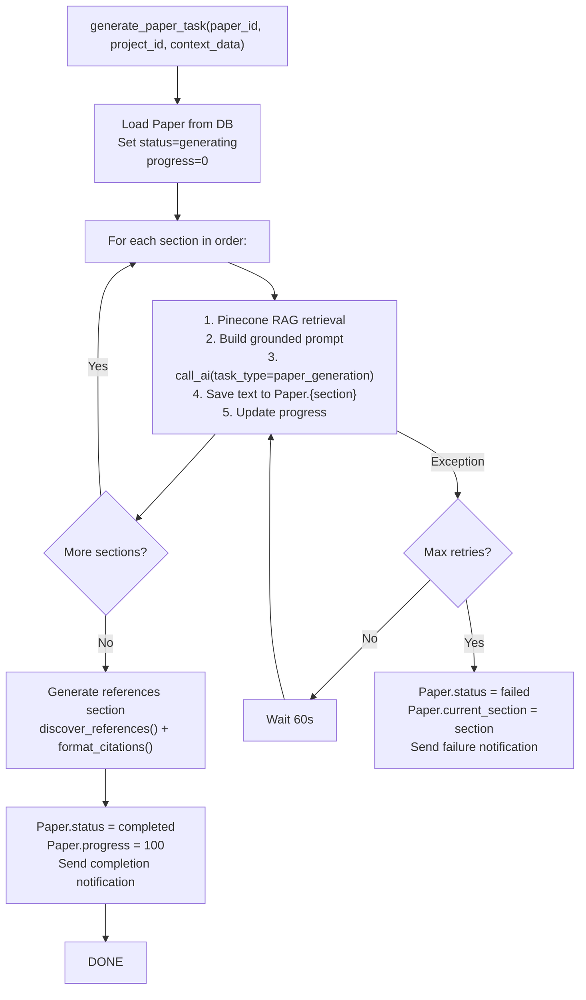

# 20 — Background Jobs (Celery)

> **Back to Index**: [00_index.md](00_index.md)

---

## 20.1 Overview

ResearchAI uses **Celery** with **Redis** as the message broker for all long-running operations. This ensures the Flask API responds immediately with a task ID, while the actual work happens asynchronously in worker processes.

---

## 20.2 Task Inventory

| Task Name | Module | Trigger | Retries | Est. Duration |
|-----------|--------|---------|---------|--------------|
| `tasks.embed_document` | `tasks/embed_document.py` | Document upload | 3 × 30s | 10-60s |
| `tasks.delete_document_vectors` | `tasks/embed_document.py` | Document delete | 3 × 15s | 2-10s |
| `tasks.delete_all_project_vectors` | `tasks/embed_document.py` | Project delete | 3 × 15s | 2-10s |
| `tasks.generate_paper` | `tasks/paper_tasks.py` | Generate button | 2 × 60s | 2-15 min |
| `tasks.preprocess_task` | `tasks/plagiarism_tasks.py` | Plagiarism scan | 0 | 1-5s |
| `tasks.exact_match_scan` | `tasks/plagiarism_tasks.py` | Plagiarism scan | 0 | 5-30s |
| `tasks.semantic_scan` | `tasks/plagiarism_tasks.py` | Plagiarism scan | 0 | 10-60s |
| `tasks.ai_verification` | `tasks/plagiarism_tasks.py` | Plagiarism scan | 0 | 5-30s |
| `tasks.aggregate_results` | `tasks/plagiarism_tasks.py` | Plagiarism scan | 0 | 1-5s |
| `tasks.paraphrase` | `tasks/paraphraser_tasks.py` | Paraphrase request | 2 × 30s | 5-30s |
| `tasks.ai_detection` | `tasks/ai_detection_tasks.py` | Detection request | 2 × 30s | 5-60s |

---

## 20.3 Celery Configuration

```python
celery_app.config_from_object({
    "broker_url":                      "redis://localhost:6379/0",
    "result_backend":                  "redis://localhost:6379/0",
    "task_serializer":                 "json",
    "result_serializer":               "json",
    "accept_content":                  ["json"],
    "result_expires":                  3600,      # Task results kept 1 hour
    "task_track_started":              True,      # Track when task starts (not just when queued)
    "broker_connection_retry_on_startup": True,   # Retry Redis connection at startup
    "include": [
        "tasks.paper_tasks",
        "tasks.embed_document",
        "tasks.plagiarism_tasks",
        "tasks.standalone_plagiarism_tasks",
        "tasks.paraphraser_tasks",
        "tasks.ai_detection_tasks",
    ]
})
```

---

## 20.4 Worker Startup & Process Safety

### Connection Crash Protection
When Celery forks worker processes, children inherit the parent's PostgreSQL connections — which are invalid across fork boundaries. The `@worker_process_init` signal forces fresh connections:

```python
@worker_process_init.connect
def fix_celery_pool_connections(**kwargs):
    app = create_app()
    with app.app_context():
        db.engine.dispose()  # Forces new connections from pool in each worker
```

### Flask App Context
Every Celery task runs inside a Flask app context via the `FlaskTask` wrapper:
```python
class FlaskTask(Task):
    def __call__(self, *args, **kwargs):
        with app.app_context():
            try:
                return self.run(*args, **kwargs)
            finally:
                db.session.remove()  # Return connection to pool after every task
```

---

## 20.5 Paper Generation Task (`tasks/paper_tasks.py`)



**Progress tracking**: Each section increments `paper.progress` by `100 / num_sections`. The UI polls this every 3 seconds.

**Notification on completion**:
```python
notification = Notification(
    user_id=user_id,
    type="paper_done",
    title="Paper Generation Complete",
    body=f'Your paper "{paper.title}" is ready!',
    resource_id=str(paper.id)
)
db.session.add(notification)
```

---

## 20.6 Plagiarism Chord Pipeline

Celery `chord` runs tasks in parallel and then calls a callback:

```python
from celery import chord

# parallel_group runs concurrently
parallel_group = group([
    exact_match_scan.s(prep_data, project_id, scan_task_id),
    semantic_scan.s(prep_data, project_id, scan_task_id)
])

# chord = parallel + serial callback
workflow = (
    preprocess_task.s(scan_task_id, text)
    | chord(parallel_group, ai_verification_task.s(scan_task_id))
    | aggregate_results.s(scan_task_id)
)

workflow.delay()
```

This ensures `preprocess_task` completes first, then exact and semantic scans run **in parallel** (saving time), and `ai_verification` + `aggregate_results` run after both are done.

---

## 20.7 Task Status Tracking

Tasks update their status in the `ScanTask` DB table:

```python
task = ScanTask.query.get(scan_task_id)
task.status = "processing"
task.progress = 40
task.current_step = "Running Semantic Similarity Analysis..."
db.session.commit()
```

**Frontend polling** every 3 seconds:
```javascript
const pollStatus = async () => {
    const status = await apiFetch(`/papers/${paperId}/plagiarism/status`);
    updateUI(status.progress, status.current_step);
    
    if (['completed', 'failed'].includes(status.status)) {
        clearInterval(pollInterval);
    }
};
```

---

## 20.8 Error Handling & Retry Policy

### Transient Error Retry (embed_document)
```python
@shared_task(bind=True, max_retries=3, default_retry_delay=30)
def embed_document(self, ...):
    try:
        # ... do work
    except Exception as exc:
        try:
            raise self.retry(exc=exc)
        except self.MaxRetriesExceededError:
            _update_doc_status(document_id, "embed_error", str(exc))
```

### Permanent Failure (plagiarism)
Plagiarism tasks don't retry — a partial retry could produce incorrect merged results. On failure:
```python
def _write_failed_status(task, e, scan_task_id, logger):
    task.status = "failed"
    task.error_msg = f"[{e.__class__.__name__}] {str(e)[:500]}"
    db.session.commit()
```

---

## 20.9 Worker Commands

```bash
# Start worker
celery -A app.celery worker --loglevel=info --concurrency=4

# Start worker with specific queue
celery -A app.celery worker -Q embed,generation --concurrency=2

# Monitor tasks
celery -A app.celery flower --port=5555

# Inspect active tasks
celery -A app.celery inspect active

# Purge all queued tasks
celery -A app.celery purge
```

---

## 20.10 Redis Keys Used

| Pattern | Contents | TTL |
|---------|----------|-----|
| `celery-task-meta-<uuid>` | Task result JSON | 3600s |
| `_kombu.binding.*` | Celery routing tables | Permanent |
| `blocklist:<jti>` | JWT revocation entries | Token remaining lifetime |
| Rate limiter keys | `flask_limiter:*` | Window duration |
