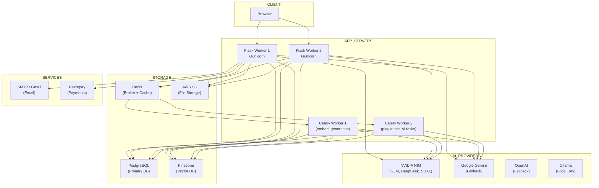

# 21 — Infrastructure

> **Back to Index**: [00_index.md](00_index.md)

---

## 21.1 Infrastructure Components



---

## 21.2 PostgreSQL

**Role**: Primary relational database for all structured application data.

### Configuration
- **Pool size**: 10 persistent connections per worker
- **Max overflow**: 20 (burst capacity)
- **Pool timeout**: 30 seconds
- **Pool recycle**: 1800 seconds (prevents stale connection kills)
- **Pre-ping**: Validates connection liveness before use

### Key Features Used
- **UUID PKs**: All tables use `PG_UUID(as_uuid=True)` primary keys
- **pg_trgm**: Trigram similarity extension for plagiarism candidate retrieval
- **Row-Level Security (RLS)**: Enforced via `db_session_events.py` + `SET LOCAL` variables
- **Timezone-aware timestamps**: All datetime columns use `timezone=True`
- **Soft deletes**: `deleted_at` column on all tables (no hard deletes in production)

### Migration Management
Flask-Migrate (Alembic-based):
```bash
flask db init        # Initialize migration directory
flask db migrate -m "Add institution table"  # Auto-generate migration
flask db upgrade     # Apply migrations
flask db downgrade   # Roll back one version
```

---

## 21.3 Redis

**Role**: Celery message broker, task result backend, JWT blocklist, rate limiter storage.

### Database Allocation
| DB | Usage |
|----|-------|
| DB 0 | Celery broker (task queue) + Celery result backend |
| DB 1 | JWT token blocklist + Flask-Limiter rate counters |

### Key Patterns
```
# Celery
celery-task-meta-<uuid>      → Task result JSON (TTL: 3600s)
_kombu.binding.celery        → Routing tables

# JWT Blocklist
blocklist:<jti>              → "1" (TTL = token remaining lifetime)

# Rate Limiter
LIMITER/<endpoint>/<ip>      → Counter + window (TTL = window duration)
```

### Configuration
```env
CELERY_BROKER_URL=redis://localhost:6379/0
CELERY_RESULT_BACKEND=redis://localhost:6379/0
REDIS_URL=redis://localhost:6379/1         # JWT blocklist DB
RATELIMIT_STORAGE_URI=redis://localhost:6379/1
```

---

## 21.4 Pinecone Vector Database

**Role**: Stores document chunk embeddings for RAG retrieval.

### Configuration
```env
PINECONE_API_KEY=pc-xxxxx
PINECONE_ENV=us-east-1
PINECONE_INDEX=researchai-dev
```

### Index Structure
- **Index name**: `researchai-dev` (single shared index)
- **Metric**: Cosine similarity
- **Namespaces**: `project_<uuid>` — one per project (tenant isolation)
- **Dimensions**: 384 (all-MiniLM-L6-v2 output dimension)

### Operations
| Operation | When | Scope |
|-----------|------|-------|
| `upsert()` | Document embedding | Document namespace |
| `query()` | Paper generation retrieval | Project namespace |
| `delete(filter=...)` | Document deletion (GDPR) | Document within namespace |
| `delete(delete_all=True)` | Project deletion (GDPR) | Entire namespace |

> [!CAUTION]
> The index is named `researchai-dev`. In production, create a separate `researchai-prod` index. Deleting or resetting the dev index for testing would destroy production data if they share an index.

---

## 21.5 AWS S3

**Role**: File storage for uploaded documents (fallback to local `uploads/` directory in dev).

### Configuration
```env
AWS_ACCESS_KEY=AKIAXXXXXXXX
AWS_SECRET_KEY=xxxxxxxxxxxx
AWS_S3_BUCKET=researchai-docs
AWS_REGION=ap-south-1
```

### Usage
- Documents uploaded to `uploads/<uuid>/<filename>` locally or to S3 key `documents/<user_id>/<doc_id>/<filename>`
- `Document.s3_key` stores the S3 object key
- `Document.local_path` stores local path (used in dev without S3)
- Presigned URLs generated for download (if applicable)

---

## 21.6 Email (SMTP)

**Role**: OTP delivery for email verification, password reset, notifications.

### Configuration
```env
MAIL_SERVER=smtp.gmail.com
MAIL_PORT=587
MAIL_USE_TLS=True
MAIL_USERNAME=noreply@researchai.in
MAIL_PASSWORD=app-specific-password
MAIL_DEFAULT_SENDER=noreply@researchai.in
```

### Emails Sent
- Email verification OTP (on register)
- Password reset link
- Welcome email (on first login)
- Paper generation completion notification (future: real email)
- Payment confirmation

---

## 21.7 Razorpay (Payments)

**Role**: INR payment gateway for subscription billing.

### Configuration
```env
RAZORPAY_KEY_ID=rzp_live_xxxxx
RAZORPAY_KEY_SECRET=xxxxxxxxxxxxx
```

### Flow
1. User selects plan → `POST /api/user/subscription/create-order`
2. Razorpay order created → `order_id` returned to frontend
3. Frontend opens Razorpay checkout modal
4. User pays → Razorpay sends webhook to `/api/user/subscription/verify`
5. Payment verified → `User.plan` updated → `Subscription` record created → `Invoice` generated

---

## 21.8 Environment Variables Reference

| Variable | Required | Default | Description |
|----------|----------|---------|-------------|
| `DATABASE_URL` | ✅ | None (fatal) | PostgreSQL connection string |
| `JWT_SECRET_KEY` | ✅ | None (fatal) | JWT signing key (32+ char random) |
| `SECRET_KEY` | ✅ | dev-secret | Flask session secret |
| `REDIS_URL` | — | redis://localhost:6379/1 | JWT blocklist Redis |
| `CELERY_BROKER_URL` | — | redis://localhost:6379/0 | Celery broker |
| `CELERY_RESULT_BACKEND` | — | redis://localhost:6379/0 | Celery results |
| `PINECONE_API_KEY` | — | "" | Pinecone API key |
| `PINECONE_ENV` | — | us-east-1 | Pinecone region |
| `GLM_API_KEY` | — | "" | GLM primary API key (paper gen) |
| `GLM_API_KEY_FALLBACK` | — | "" | GLM fallback key |
| `GLM_BASE_URL` | — | open.bigmodel.cn | GLM API endpoint |
| `DEEPSEEK_DEFAULT_API_KEY` | — | "" | DeepSeek default key |
| `DEEPSEEK_PLAGIARISM_API_KEY` | — | "" | DeepSeek plagiarism key |
| `DEEPSEEK_PARAPHRASER_API_KEY` | — | "" | DeepSeek paraphraser key |
| `DEEPSEEK_HUMANIZER_API_KEY` | — | "" | DeepSeek humanizer key |
| `DEEPSEEK_AI_DETECTION_API_KEY` | — | "" | DeepSeek AI detection key |
| `DEEPSEEK_BASE_URL` | — | integrate.api.nvidia.com/v1 | NVIDIA NIM endpoint |
| `GOOGLE_API_KEY` | — | "" | Google Gemini API key |
| `OPENAI_API_KEY` | — | "" | OpenAI API key |
| `OLLAMA_MODEL` | — | "" | Local Ollama model name |
| `OLLAMA_BASE_URL` | — | http://localhost:11434 | Ollama server URL |
| `NVIDIA_API_KEY` | — | "" | NVIDIA NIM key (diagrams) |
| `NVIDIA_API_KEY_SCAN` | — | "" | NVIDIA key for diagram scanning |
| `NVIDIA_API_KEY_GENERATE` | — | "" | NVIDIA key for image generation |
| `AWS_ACCESS_KEY` | — | "" | AWS access key |
| `AWS_SECRET_KEY` | — | "" | AWS secret key |
| `AWS_S3_BUCKET` | — | researchai-docs | S3 bucket name |
| `AWS_REGION` | — | ap-south-1 | AWS region |
| `RAZORPAY_KEY_ID` | — | "" | Razorpay key ID |
| `RAZORPAY_KEY_SECRET` | — | "" | Razorpay secret |
| `COPYLEAKS_API_KEY` | — | "" | Copyleaks API key |
| `MAIL_SERVER` | — | smtp.gmail.com | SMTP server |
| `MAIL_USERNAME` | — | "" | SMTP username |
| `MAIL_PASSWORD` | — | "" | SMTP password |
| `GOOGLE_CLIENT_ID` | — | "" | Google OAuth client ID |
| `GOOGLE_CLIENT_SECRET` | — | "" | Google OAuth secret |
| `FRONTEND_URL` | — | http://localhost:5002 | CORS allowed origin |
| `FLASK_ENV` | — | development | `production` enables secure cookies |
| `DEV_LLM_PROVIDER` | — | "" | `ollama` = skip cloud providers |
