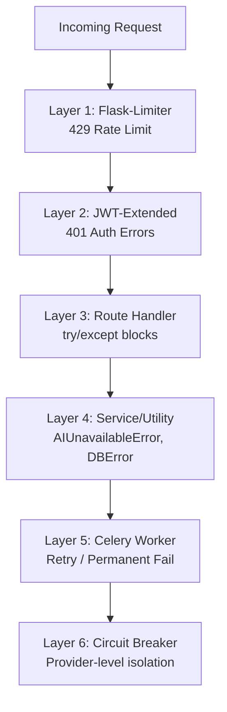
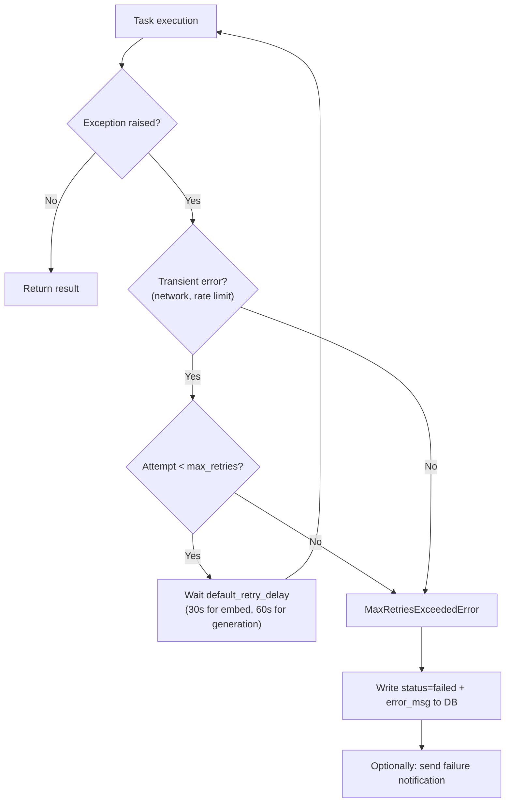
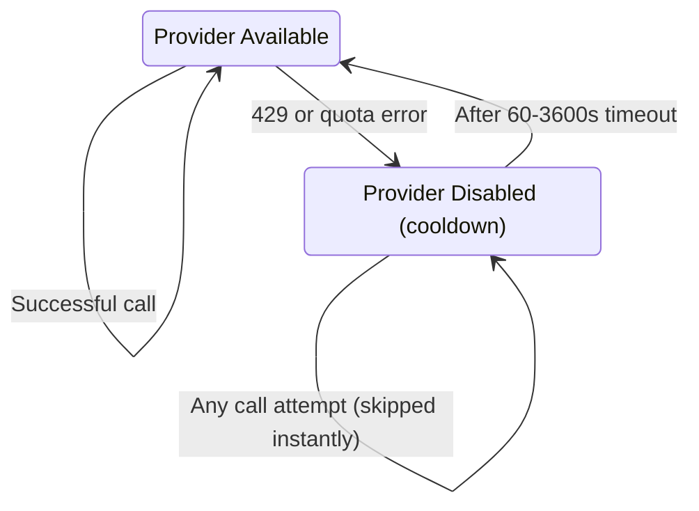

# 23 — Error Handling

> **Back to Index**: [00_index.md](00_index.md)

---

## 23.1 Error Handling Layers



---

## 23.2 HTTP Error Responses

All API errors return consistent JSON:
```json
{ "error": "Human-readable error message" }
```

### Standard Error Map

| Situation | Code | Response |
|-----------|------|----------|
| Invalid input | 400 | `{"error": "paragraph_text is required"}` |
| Not authenticated | 401 | `{"error": "Authentication required."}` |
| Token revoked | 401 | `{"error": "Token has been revoked. Please log in again."}` |
| Token expired | 401 | `{"error": "Token has expired. Please refresh or log in again."}` |
| Forbidden resource | 403 | `{"error": "Access forbidden"}` |
| Not found | 404 | `{"error": "Not found"}` (via `get_or_404`) |
| Rate limit | 429 | `{"error": "Rate limit exceeded: 10 per 1 minute"}` |
| All AI providers down | 503 | `{"error": "AI service temporarily unavailable"}` |
| Internal error | 500 | `{"error": "Internal server error"}` |

---

## 23.3 Global Error Handlers (`app.py`)

```python
@jwt_manager.token_in_blocklist_loader
def check_if_token_revoked(jwt_header, jwt_payload):
    jti = jwt_payload["jti"]
    return redis_client.get(f"blocklist:{jti}") is not None

@jwt_manager.revoked_token_loader
def revoked_token_callback(jwt_header, jwt_payload):
    return {"error": "Token has been revoked. Please log in again."}, 401

@jwt_manager.expired_token_loader
def expired_token_callback(jwt_header, jwt_payload):
    return {"error": "Token has expired. Please refresh or log in again."}, 401

@jwt_manager.unauthorized_loader
def missing_token_callback(error):
    return {"error": "Authentication required."}, 401

@app.errorhandler(429)
def ratelimit_handler(e):
    return {"error": f"Rate limit exceeded: {e.description}"}, 429
```

---

## 23.4 AI Provider Failure Handling

### AIUnavailableError
```python
class AIUnavailableError(RuntimeError):
    """Raised by call_ai when every provider in the waterfall has failed."""
    pass
```

Routes catch this and return 503:
```python
try:
    text = call_ai(prompt, task_type="paper_generation", max_tokens=1500)
except AIUnavailableError:
    return jsonify({"error": "AI service temporarily unavailable. Please try again."}), 503
```

### Safe Failure in Celery
In Celery tasks, AI failures don't crash the entire task:
```python
try:
    section_text = generate_paper_section(section, context)
    paper.methodology = section_text
except AIUnavailableError:
    paper.methodology = "[Section generation failed — please regenerate this section]"
    logger.error("Section generation failed for paper_id=%s section=%s", paper.id, section)
    # Continue with remaining sections
```

---

## 23.5 Database Error Handling

```python
try:
    db.session.add(new_record)
    db.session.commit()
except IntegrityError as e:
    db.session.rollback()
    return jsonify({"error": "Email already registered"}), 409
except Exception as e:
    db.session.rollback()
    logger.error("DB error: %s", e, exc_info=True)
    return jsonify({"error": "Database error"}), 500
```

**Always rollback on failure** — SQLAlchemy sessions that fail without rollback remain in a broken state.

---

## 23.6 Celery Task Retry Logic



---

## 23.7 Circuit Breaker Error Isolation

The circuit breaker prevents cascading failures:



**Effect on waterfall**: When GLM's circuit is open, `_try_glm()` returns `(None, 0, 0)` immediately (no HTTP call made), and `call_ai()` falls through to Gemini without delay.

---

## 23.8 Score Safety (`utils/score_safety.py`)

All numeric scores (plagiarism, AI detection, quality grades) pass through:

```python
def sanitize_score(score: float) -> float:
    """Clamp score to [0, 100], handle NaN, None, Infinity."""
    if score is None or math.isnan(score) or math.isinf(score):
        return 0.0
    return round(max(0.0, min(100.0, float(score))), 2)
```

This prevents edge cases from corrupting the UI or DB with invalid values.

---

## 23.9 Frontend Error Handling

```javascript
// apiFetch global error handler
async function apiFetch(path, options = {}) {
    try {
        const response = await fetch('/api' + path, {...options});
        
        if (response.status === 401) {
            nav('login');
            return null;
        }
        
        if (!response.ok) {
            const error = await response.json();
            throw new Error(error.error || 'Request failed');
        }
        
        return response.json();
    } catch (err) {
        showToast(err.message, 'error');
        throw err;
    }
}
```

Every screen wraps async operations:
```javascript
try {
    const paper = await apiFetch(`/papers/${paperId}`);
    renderEditor(paper);
} catch (err) {
    document.getElementById('screen-container').innerHTML = errorHTML(err.message);
}
```
