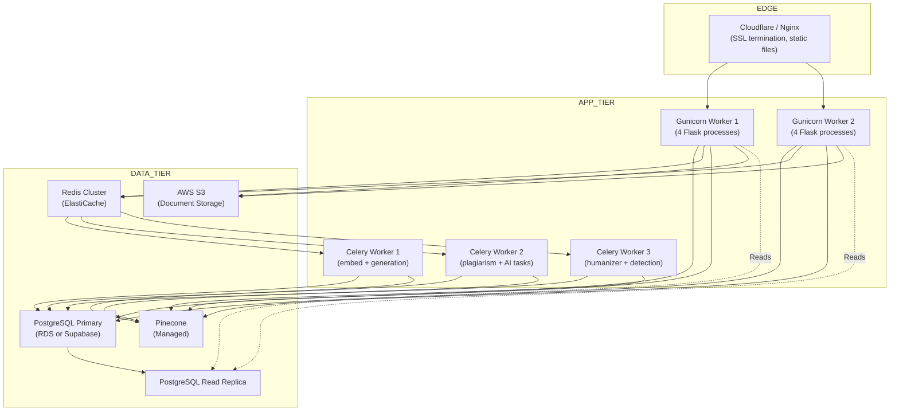

# 28 — Deployment Architecture

> **Back to Index**: [00_index.md](00_index.md)

---

## 28.1 Current Development Setup

```bash
# Terminal 1: Flask web server
flask run --port=5002

# Terminal 2: Celery worker (all queues)
celery -A app.celery worker --loglevel=info --concurrency=4

# Terminal 3: Redis (if not running as service)
redis-server

# Database: PostgreSQL (system service)
# Pinecone: Managed service (cloud)
```

---

## 28.2 Production Deployment Architecture



---

## 28.3 Docker Compose (Recommended)

```yaml
version: '3.9'
services:
  flask:
    build: .
    command: gunicorn -w 4 -b 0.0.0.0:5000 "app:create_app()"
    env_file: .env.production
    ports:
      - "5000:5000"
    depends_on:
      - postgres
      - redis

  celery_embed:
    build: .
    command: celery -A app.celery worker -Q embed --concurrency=2 --loglevel=info
    env_file: .env.production
    depends_on:
      - postgres
      - redis

  celery_ai:
    build: .
    command: celery -A app.celery worker -Q generation,plagiarism --concurrency=2 --loglevel=info
    env_file: .env.production
    depends_on:
      - postgres
      - redis

  postgres:
    image: postgres:15
    environment:
      POSTGRES_DB: researchai_prod
      POSTGRES_USER: researchai
      POSTGRES_PASSWORD: "${POSTGRES_PASSWORD}"
    volumes:
      - pgdata:/var/lib/postgresql/data
    ports:
      - "5432:5432"

  redis:
    image: redis:7
    ports:
      - "6379:6379"
    volumes:
      - redisdata:/data

  nginx:
    image: nginx:alpine
    ports:
      - "80:80"
      - "443:443"
    volumes:
      - ./nginx.conf:/etc/nginx/conf.d/default.conf
      - ./static:/var/www/static:ro
    depends_on:
      - flask

volumes:
  pgdata:
  redisdata:
```

---

## 28.4 Dockerfile

```dockerfile
FROM python:3.11-slim

WORKDIR /app

# Install system dependencies (OCR, PDF)
RUN apt-get update && apt-get install -y \
    tesseract-ocr \
    libpq-dev \
    && rm -rf /var/lib/apt/lists/*

COPY requirements.txt .
RUN pip install --no-cache-dir -r requirements.txt

# Download embedding model at build time (not at runtime)
RUN python -c "from sentence_transformers import SentenceTransformer; SentenceTransformer('all-MiniLM-L6-v2')"

COPY . .

# Create upload directory
RUN mkdir -p uploads

EXPOSE 5000

CMD ["gunicorn", "-w", "4", "-b", "0.0.0.0:5000", "app:create_app()"]
```

---

## 28.5 Nginx Configuration

```nginx
upstream flask_app {
    server flask:5000;
    keepalive 32;
}

server {
    listen 80;
    server_name researchai.in www.researchai.in;
    return 301 https://$host$request_uri;
}

server {
    listen 443 ssl http2;
    server_name researchai.in;

    ssl_certificate /etc/ssl/certs/researchai.crt;
    ssl_certificate_key /etc/ssl/private/researchai.key;

    # Serve static files directly (bypass Flask)
    location /static/ {
        alias /var/www/static/;
        expires 7d;
        add_header Cache-Control "public, immutable";
    }

    # Proxy API and main app to Flask
    location / {
        proxy_pass http://flask_app;
        proxy_set_header Host $host;
        proxy_set_header X-Real-IP $remote_addr;
        proxy_set_header X-Forwarded-Proto https;

        # Increase timeouts for long-running generation
        proxy_read_timeout 300;
        proxy_send_timeout 300;
    }
}
```

---

## 28.6 Production Checklist

### Environment Variables
```env
FLASK_ENV=production
DEBUG=False
JWT_COOKIE_SECURE=True         # HTTPS only cookies
SECRET_KEY=<64-char-random>    # Must be cryptographically random
JWT_SECRET_KEY=<64-char-random>
DATABASE_URL=postgresql://...  # Production database
```

### Database
```bash
# Run migrations
flask db upgrade

# Enable pg_trgm extension
psql -c "CREATE EXTENSION IF NOT EXISTS pg_trgm;"
```

### Pre-flight Checks
```bash
# Verify Celery workers
celery -A app.celery inspect ping

# Verify Redis connection
redis-cli ping

# Verify Pinecone
python -c "from utils.pinecone_search import pc; print(pc.list_indexes())"

# Run smoke tests
python -m pytest tests/ -k "smoke"
```

---

## 28.7 Scaling Strategy

### Horizontal Scaling (Stateless Flask)
Add more Gunicorn processes or containers. Flask has no server-side session state (all state in JWT + DB).

```bash
# Scale to 8 Flask workers in Kubernetes
kubectl scale deployment flask --replicas=8
```

### Celery Worker Scaling
Separate queues per task type enables independent scaling:
```bash
# Scale embed workers separately (CPU-bound)
kubectl scale deployment celery-embed --replicas=4

# Scale AI workers (I/O-bound, waiting on LLM API)
kubectl scale deployment celery-ai --replicas=6
```

### Database Scaling
- Read replicas: Route `SELECT` queries from paper status polling to replica
- Connection pooling: PgBouncer in front of PostgreSQL
- Partitioning: `usage_logs` by month (grows fastest)

---

## 28.8 Backup & Disaster Recovery

### PostgreSQL Backup
```bash
# Daily backup
pg_dump -Fc researchai_prod | gzip > backups/$(date +%Y%m%d).dump.gz

# Upload to S3
aws s3 cp backups/$(date +%Y%m%d).dump.gz s3://researchai-backups/db/
```

### Pinecone Disaster Recovery
Pinecone does not support direct backup/restore. The recovery strategy is:
1. Re-upload all project documents
2. Re-trigger `embed_document` tasks for all projects
3. This reconstructs all vector namespaces from the source documents

Since source documents are backed up to S3, full recovery is possible — but time-consuming at scale.

### Recovery Time Objectives (Target)
| Scenario | RTO | RPO |
|----------|-----|-----|
| Flask process crash | < 30s (Gunicorn restart) | 0 |
| Redis crash | < 5min (restart + reconnect) | In-flight tasks lost |
| Celery worker crash | < 2min (restart) | Current task retried |
| PostgreSQL crash | < 15min (failover to replica) | < 1min (WAL lag) |
| Full server failure | 1-4 hours (restore from backup) | 24h (daily backups) |
