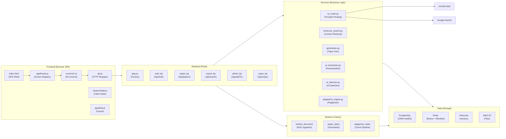
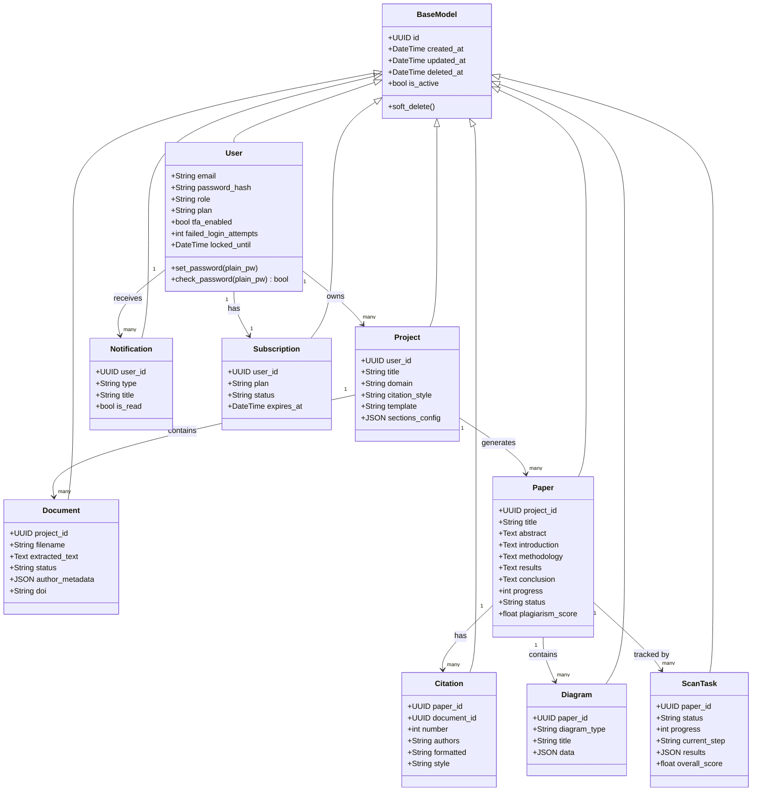
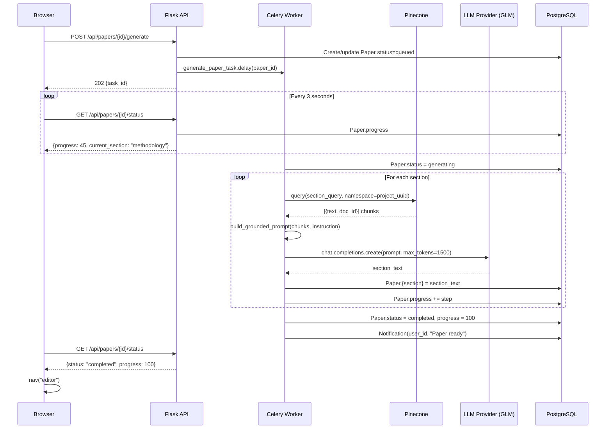
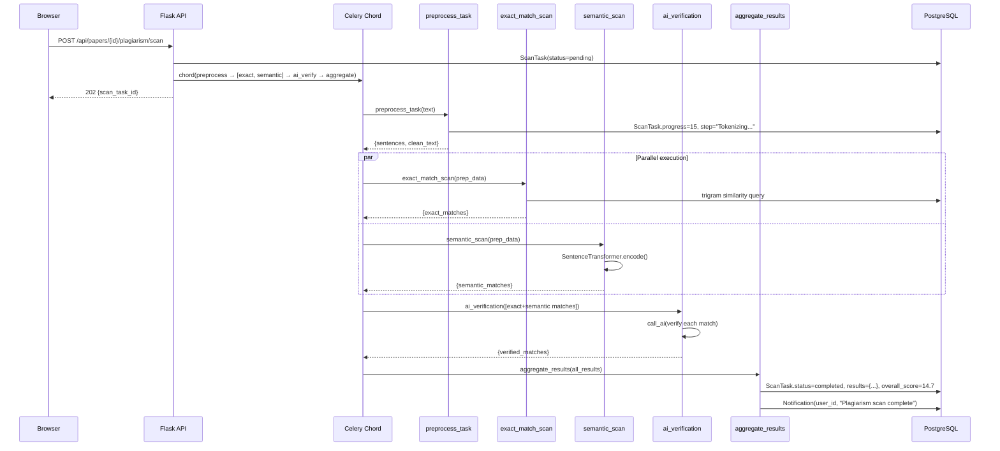
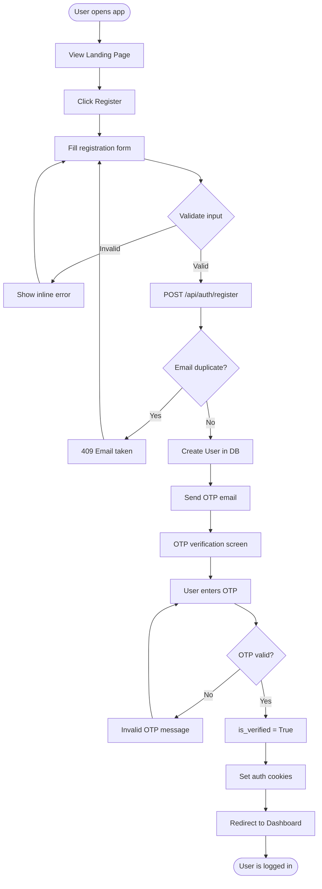

# 29 — UML Diagrams

> **Back to Index**: [00_index.md](00_index.md)

---

## 29.1 Component Diagram

---

## 29.2 Class Diagram — Domain Models

---

## 29.3 Sequence Diagram — Paper Generation

---

## 29.4 Sequence Diagram — Plagiarism Scan

---

## 29.5 Activity Diagram — User Registration

