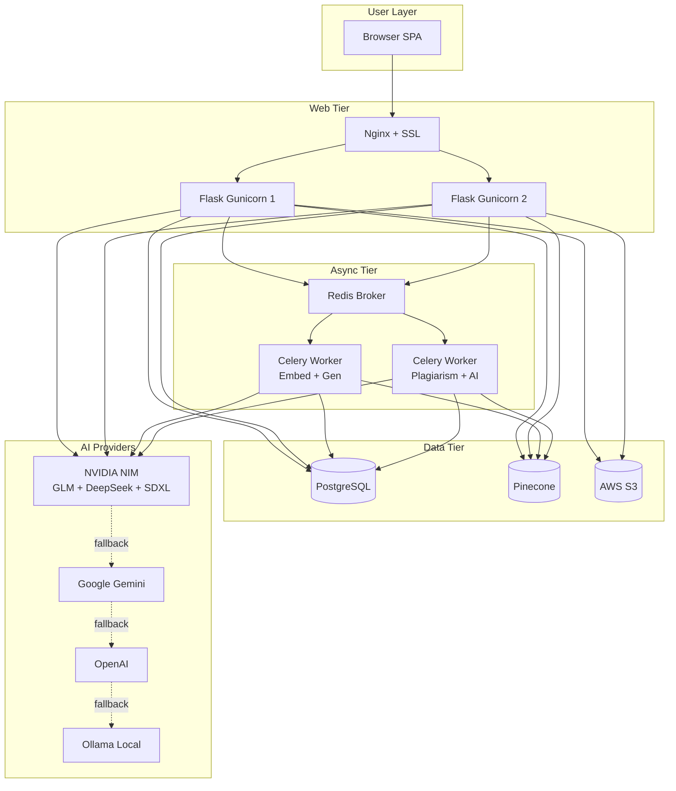
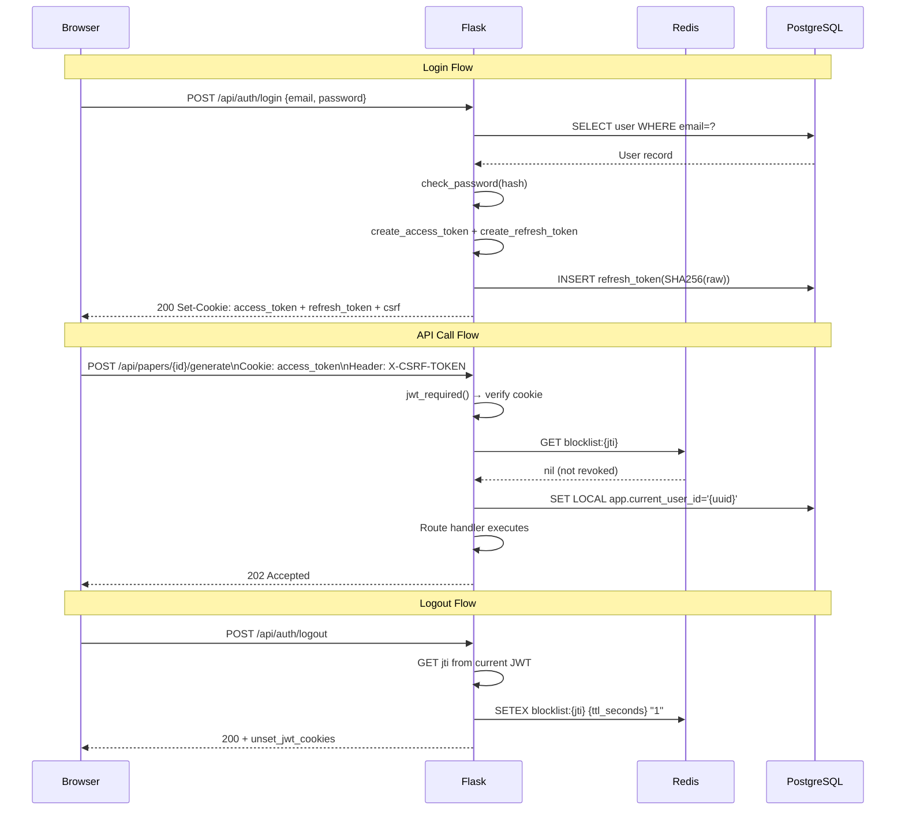
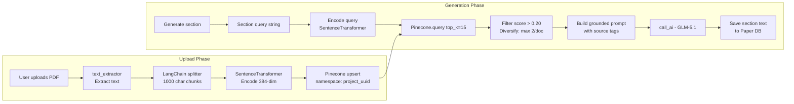
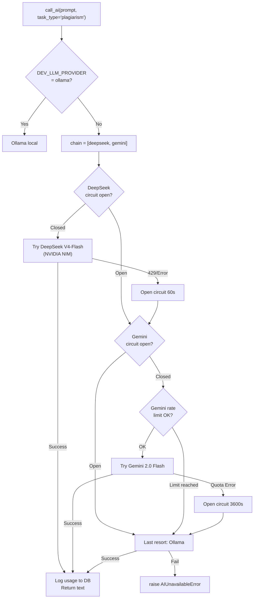
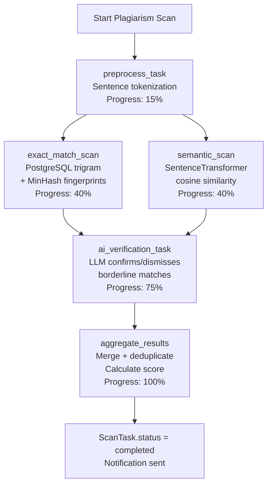
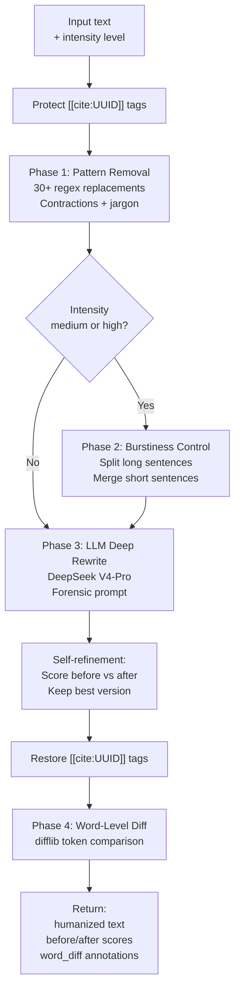
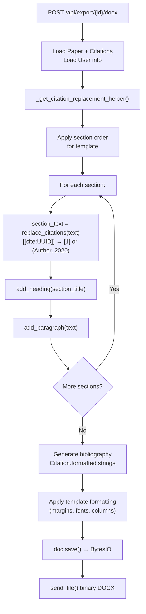
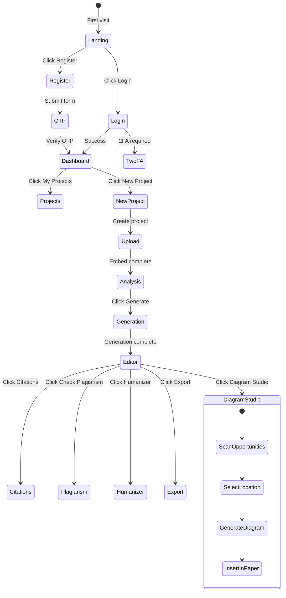

# 30 — Mermaid Diagrams

> **Back to Index**: [00_index.md](00_index.md)

---

## 30.1 System Architecture Diagram

---

## 30.2 Auth + Token Flow

---

## 30.3 RAG Pipeline Flow

---

## 30.4 Multi-Model Router Flow

---

## 30.5 Plagiarism Scan Pipeline

---

## 30.6 AI Humanizer Flow

---

## 30.7 Export Flow

---

## 30.8 Frontend SPA Navigation

