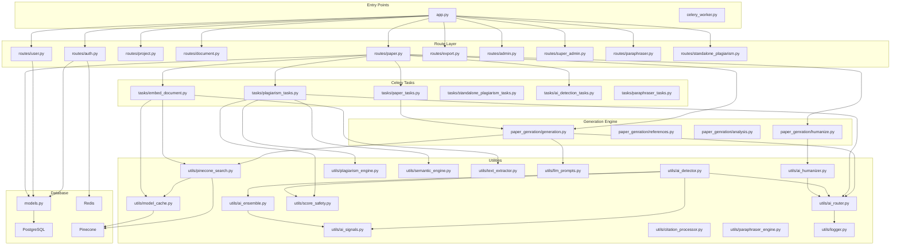
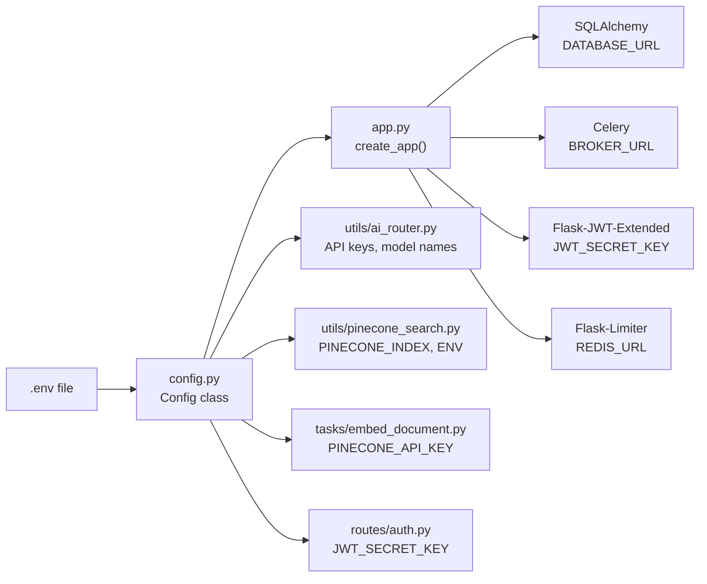

# 31 — Knowledge Graph

> **Back to Index**: [00_index.md](00_index.md)

---

## 31.1 Module Dependency Graph



---

## 31.2 File Dependency Reference

| File | Imports From | Imported By |
|------|-------------|-------------|
| `app.py` | `config`, `models`, all routes, all tasks | Entry point |
| `models.py` | `flask_sqlalchemy`, `uuid` | Every route, every task |
| `utils/ai_router.py` | `config`, `models` (UsageLog), `utils/logger` | `paper_genration/*`, `utils/ai_humanizer`, `utils/ai_detector`, `tasks/*` |
| `utils/pinecone_search.py` | `utils/model_cache`, `config` | `paper_genration/generation.py`, `tasks/embed_document.py` |
| `utils/model_cache.py` | `sentence_transformers` | `utils/pinecone_search`, `utils/semantic_engine` |
| `utils/ai_detector.py` | `utils/ai_router`, `utils/ai_ensemble`, `utils/ai_signals`, `utils/score_safety` | `tasks/ai_detection_tasks`, `paper_genration/ai_detection` |
| `utils/ai_humanizer.py` | `utils/ai_router`, `utils/logger` | `paper_genration/humanize`, `tasks/paraphraser_tasks` |
| `utils/plagiarism_engine.py` | none (stdlib only) | `tasks/plagiarism_tasks`, `tasks/standalone_plagiarism_tasks` |
| `utils/semantic_engine.py` | `utils/model_cache` | `tasks/plagiarism_tasks` |
| `paper_genration/generation.py` | `utils/ai_router`, `utils/pinecone_search`, `utils/llm_prompts`, `paper_genration/references` | `tasks/paper_tasks`, `routes/paper` |
| `tasks/embed_document.py` | `utils/pinecone_search`, `utils/model_cache`, `utils/text_extractor`, `models` | Triggered by `routes/document` |
| `tasks/plagiarism_tasks.py` | `utils/plagiarism_engine`, `utils/semantic_engine`, `utils/ai_router`, `utils/score_safety`, `models` | Triggered by `routes/paper` |

---

## 31.3 Configuration Dependency Map



---

## 31.4 Function Call Chain — Section Generation

```
routes/paper.py::generate_paper(paper_id)
    └── tasks/paper_tasks.generate_paper_task.delay(paper_id)
        └── paper_genration/generation.generate_paper_section(section, context)
            ├── utils/pinecone_search.get_context_with_metadata(query, project_id, top_k=5)
            │   ├── utils/model_cache.get_embedding_model()
            │   │   └── SentenceTransformer("all-MiniLM-L6-v2")
            │   ├── model.encode(query) → 384-dim vector
            │   └── pinecone_index.query(vector, namespace="project_{uuid}")
            ├── utils/llm_prompts.get_grounded_system_prompt()
            ├── utils/llm_prompts.get_section_prompt(section, context, instruction)
            └── utils/ai_router.call_ai(prompt, task_type="paper_generation", max_tokens=1500)
                ├── _try_glm(prompt, max_tokens, system_prompt) [PRIMARY]
                │   └── openai.OpenAI(base_url="open.bigmodel.cn").chat.completions.create(...)
                ├── _try_gemini(prompt, max_tokens, system_prompt) [FALLBACK 1]
                │   └── genai.GenerativeModel("gemini-2.0-flash").generate_content(...)
                └── _try_openai(prompt, max_tokens, system_prompt) [FALLBACK 2]
                    └── openai.OpenAI(api_key=openai_key).chat.completions.create(...)
```

---

## 31.5 Data Flow — Document Upload to Paper Citation

```
User uploads file
    ↓
routes/document.py::upload_document()
    → Document() record created (status=uploaded)
    → text_extractor.extract_text(file) → plain text
    → Document.extracted_text = text
    → tasks/embed_document.embed_document.delay(doc_id)
        ↓ (async, Celery worker)
        → RecursiveCharacterTextSplitter → chunks []
        → SentenceTransformer.encode(chunks) → vectors []
        → Pinecone.delete(filter={"document_id": doc_id})  # idempotency
        → Pinecone.upsert(vectors, namespace="project_{uuid}")
        → Document.status = "embedded"
        ↓
User generates paper
    ↓
tasks/paper_tasks.generate_paper_task()
    → For section "introduction":
        → Pinecone.query("background motivation...", namespace="project_{uuid}")
        → Returns [{text: "...", doc_id: "doc-uuid-X", ...}]
        → generate_paper_section uses chunks → generates text with source awareness
        → Citation record created for doc-uuid-X
            → Citation.document_id = "doc-uuid-X"
            → Citation.formatted = "[1] Smith, A. (2023). ..."
            → Inline tag inserted: "...[[cite:doc-uuid-X]]..."
        ↓
User exports paper
    ↓
routes/export.py::export_docx()
    → replace_citations("...[[cite:doc-uuid-X]]...")
    → citation_map.get("doc-uuid-X") → Citation.formatted = "[1]"
    → Output: "...[1]..." in DOCX
```
