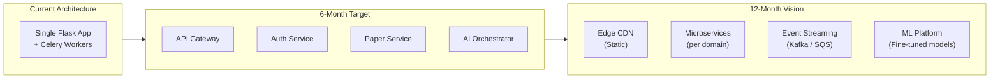

# 33 — Improvement Roadmap

> **Back to Index**: [00_index.md](00_index.md)

---

## 33.1 Overview

This roadmap is organized by timeline (immediate, short-term, long-term) and ranked by business value vs. engineering effort. Items in **Immediate** should be done before any major public launch.

---

## 33.2 Immediate (< 2 Weeks)

### 1. Critical Security Fixes
- [ ] Change `DEBUG` default to `False` in `config.py`
- [ ] Ensure `JWT_COOKIE_SECURE = True` in production config
- [ ] Add `CORS` origin validation (verify `FRONTEND_URL` is set in production)
- [ ] Rename Pinecone index from `researchai-dev` to `researchai-prod`

### 2. Database Performance
- [ ] Add missing FK indexes via Alembic migration:
  - `papers.project_id`
  - `citations.paper_id`
  - `diagrams.paper_id`
  - `scan_tasks.paper_id`
  - `notifications.user_id`
  - `usage_logs.user_id`, `usage_logs.created_at`

### 3. Input Validation
- [ ] Add Marshmallow schemas to the 5 most-used POST endpoints:
  - `/api/auth/login`, `/api/auth/register`
  - `/api/papers/<id>/humanize`
  - `/api/papers/<id>/plagiarism/scan`
  - `/api/papers/<id>/diagrams/generate`

---

## 33.3 Short-Term (1-2 Months)

### 4. Parallel Paper Generation
**Value**: Cut generation time from 2-15min to 4-6min  
**Effort**: Medium

Refactor `tasks/paper_tasks.py` to use `ThreadPoolExecutor` for independent sections:
```python
# Group 1: Parallel (independent)
with ThreadPoolExecutor(max_workers=3) as executor:
    futures = {
        executor.submit(generate_section, s, context): s
        for s in ["abstract", "introduction", "methodology"]
    }
```

### 5. Split `paper_bp` Monolith
**Value**: Maintainability, testability  
**Effort**: Medium

Split `routes/paper.py` (2756 lines) into 6 focused blueprints:
- `paper_core_bp` — CRUD
- `paper_generation_bp` — generation + analysis
- `paper_editor_bp` — editing, versioning
- `paper_citations_bp` — citation management
- `paper_analysis_bp` — plagiarism, humanizer, detection
- `paper_diagrams_bp` — diagram studio

### 6. Redis-Backed Gemini Rate Limiter
**Value**: Accurate cross-worker Gemini rate limiting  
**Effort**: Low

Replace process-level `_GeminiLimiter` with Redis sliding window:
```python
def is_gemini_allowed(redis_client, max_rpm=10) -> bool:
    now = time.time()
    key = "gemini:rpm"
    pipe = redis_client.pipeline()
    pipe.zremrangebyscore(key, 0, now - 60)
    pipe.zadd(key, {str(now): now})
    pipe.zcard(key)
    pipe.expire(key, 60)
    _, _, count, _ = pipe.execute()
    return count <= max_rpm
```

### 7. LLM Output Sanitization
**Value**: Security, prevents XSS  
**Effort**: Low

```python
# In tasks/paper_tasks.py after call_ai():
import bleach
text = call_ai(prompt, ...)
text = re.sub(r'```[a-z]*\n?|```', '', text)  # Remove code fences
text = bleach.clean(text, tags=[], strip=True)  # Strip HTML
text = text.strip()
```

### 8. Pagination on List Endpoints
**Value**: Prevents memory issues at scale  
**Effort**: Low

Add `?page=1&per_page=50` to:
- `GET /api/papers` (list all papers)
- `GET /api/citations` (list citations)
- `GET /api/notifications` (list notifications)
- `GET /api/admin/users`
- `GET /api/super/logs`

### 9. Centralize Model Name Constants
**Value**: Single point of model name management  
**Effort**: Very Low

```python
# config.py
class Models:
    DEEPSEEK_FLASH = "deepseek-ai/deepseek-v4-flash"
    DEEPSEEK_PRO   = "deepseek-ai/deepseek-v4-0324"
    GLM            = "glm-5.1"
    QWEN_72B       = "qwen/qwen2-72b-instruct"
    SDXL           = "stabilityai/stable-diffusion-xl"
    GEMINI_FLASH   = "gemini-2.0-flash"
    GPT4O_MINI     = "gpt-4o-mini"
```

---

## 33.4 Medium-Term (3-6 Months)

### 10. Secrets Management (AWS Secrets Manager / HashiCorp Vault)
Replace `.env` API key storage with a proper secrets manager:
- Automated key rotation
- Audit trail for key access
- Fine-grained access control per service
- No secrets in source control or deployment artifacts

### 11. Comprehensive Test Suite
Current state: Minimal tests. Add:
- Unit tests for all `utils/` functions (especially AI router, plagiarism engine)
- Integration tests for all API endpoints (using pytest + test DB)
- Celery task tests with mock celery
- End-to-end tests with Playwright for critical user flows

### 12. Structured Logging (JSON)
Replace current string-formatted logs with structured JSON for log aggregator compatibility:
```python
import structlog
logger = structlog.get_logger()
logger.info("section_generated", section="methodology", paper_id=str(paper.id), tokens=1243)
```

### 13. Client-Side Data Caching
Add `sessionStorage` caching to the frontend:
```javascript
const CACHE_TTL = 60000;  // 60 seconds

async function getCachedPaper(paperId) {
    const cached = sessionStorage.getItem(`paper:${paperId}`);
    if (cached) {
        const {data, ts} = JSON.parse(cached);
        if (Date.now() - ts < CACHE_TTL) return data;
    }
    const paper = await apiFetch(`/papers/${paperId}`);
    sessionStorage.setItem(`paper:${paperId}`, JSON.stringify({data: paper, ts: Date.now()}));
    return paper;
}
```

### 14. API Rate Limiting Per User
Current rate limits are per-IP. Add per-user limits using JWT identity:
```python
@limiter.limit("100 per hour", key_func=lambda: get_jwt_identity() or get_remote_address())
def generate_paper(paper_id):
    ...
```

### 15. Webhook Security (Razorpay)
Add HMAC signature verification to payment webhooks:
```python
import hmac, hashlib

def verify_razorpay_webhook(payload, signature, secret):
    expected = hmac.new(secret.encode(), payload, hashlib.sha256).hexdigest()
    return hmac.compare_digest(expected, signature)
```

---

## 33.5 Long-Term (6-12 Months)

### 16. Async Section Generation via WebSockets
Replace polling-based generation progress with WebSocket push:
```
Client ←→ WebSocket ←→ Flask/SocketIO ←→ Celery (via Redis pub/sub)
```

Sections appear in the editor live as they're generated, not after all sections complete.

### 17. Multi-Model Ensemble for Paper Generation
Rather than single-model + fallback, blend outputs from multiple models:
```
GLM-5.1 generation + DeepSeek refinement = higher quality sections
```

### 18. Citation Verification via Crossref API
Auto-verify citations by querying the Crossref API with DOI or title+author:
```python
response = requests.get(f"https://api.crossref.org/works/{doi}")
work = response.json()["message"]
citation.is_verified = True
citation.authors = format_crossref_authors(work["author"])
citation.year = work["published"]["date-parts"][0][0]
```

### 19. Collaborative Paper Editing
Real-time multi-user editing via Operational Transformation (OT) or CRDT:
- Multiple users in same paper → changes merge without conflict
- Live cursor positions visible to all collaborators
- Comment threads on specific text ranges

### 20. AI Research Intelligence Hub
Expand the AI Analysis screen to:
- Map research landscape (related papers graph)
- Identify trending topics in the domain
- Suggest top journals for submission based on content
- Alert user to newly published papers in their domain (citation alerts)

### 21. Mobile App
React Native or PWA mobile client for:
- Paper monitoring on mobile
- Notification push
- Document upload from mobile camera (OCR)

---

## 33.6 Architecture Evolution Vision



The evolution path: **Monolith → Modular Monolith → Microservices**  
No premature decomposition — the current monolith is appropriate at the current scale.
