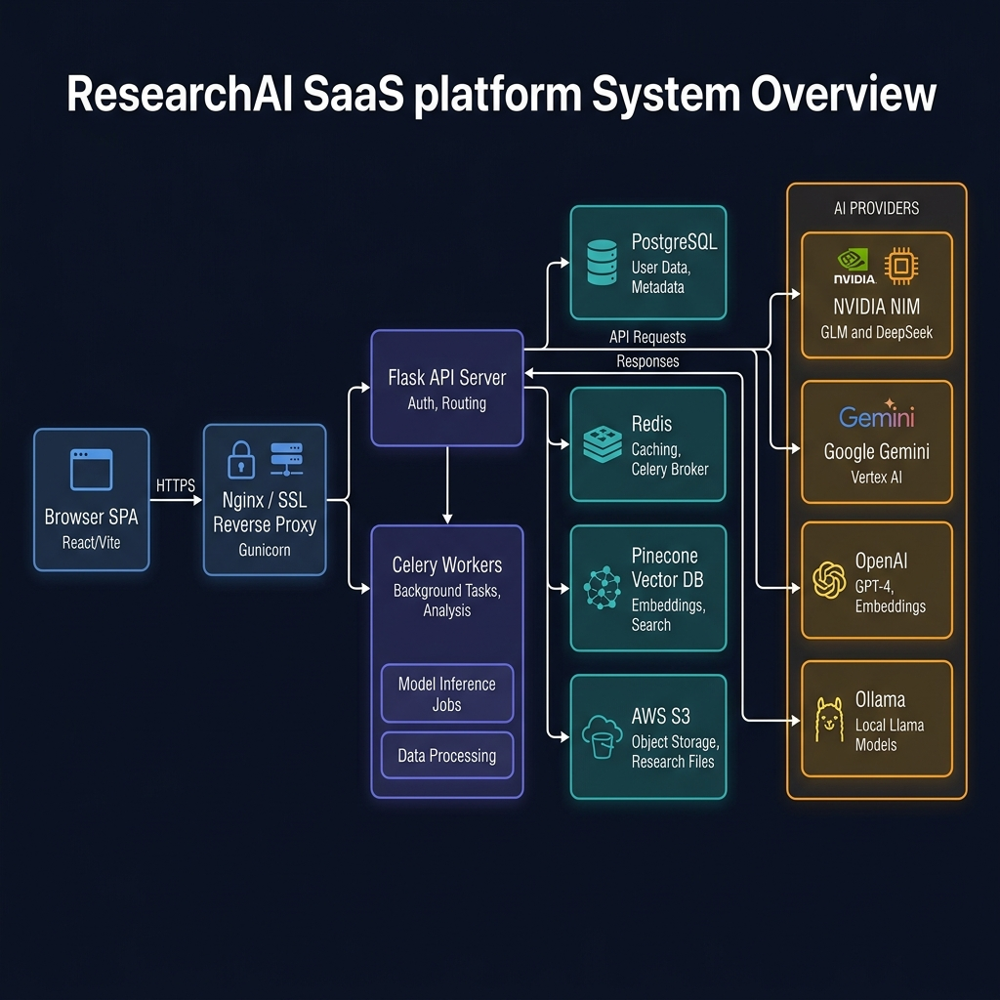
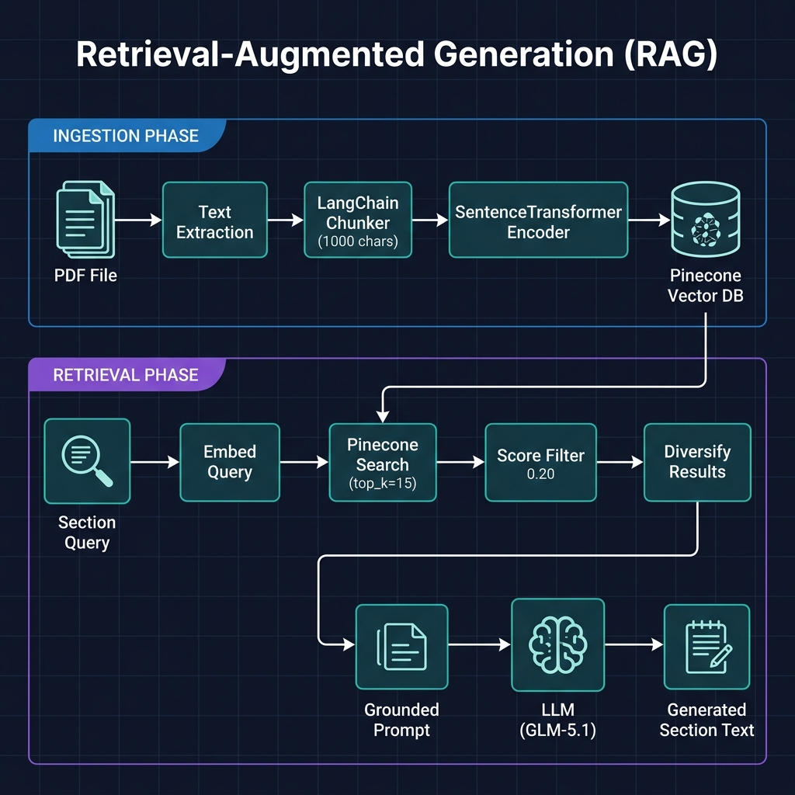
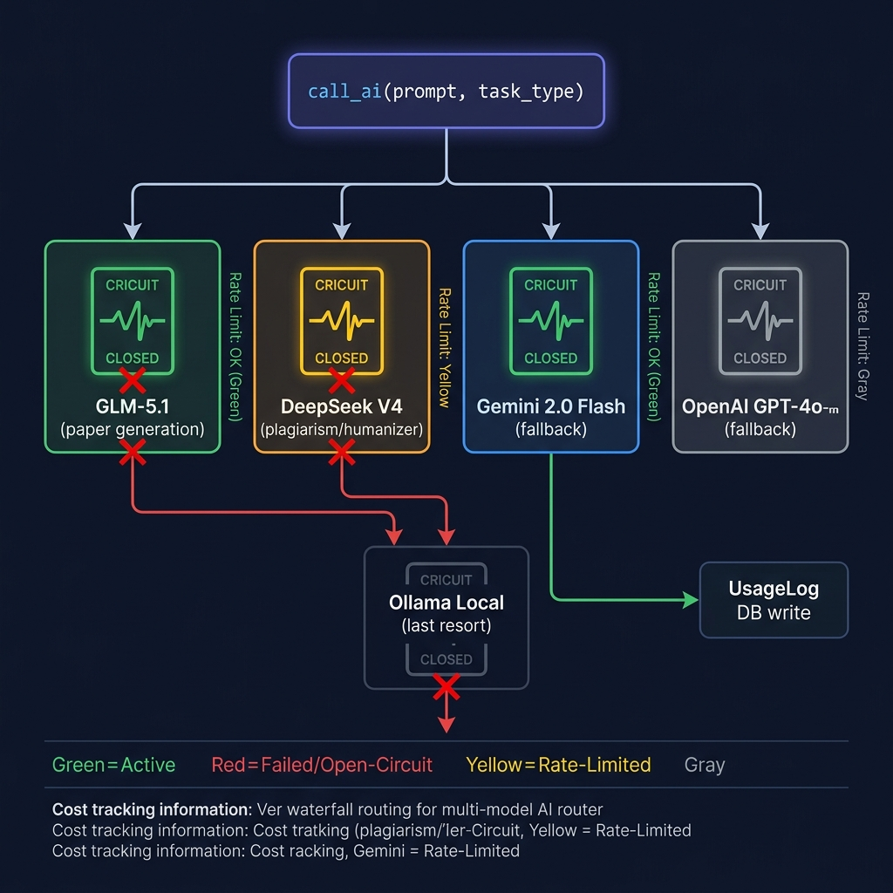
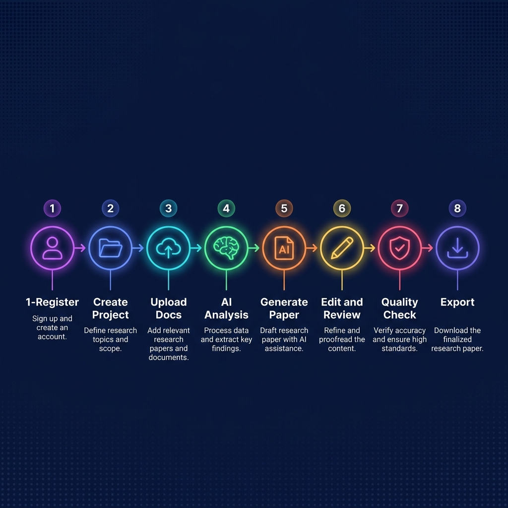

# ResearchAI — System Architecture & Workflows Executive Summary

This document provides a consolidated, visually rich summary of the ResearchAI platform's system architecture, core pipelines, model routing patterns, and end-to-end user journeys.

---

## 1. System Architecture Overview

ResearchAI is structured as a modern, decoupled SaaS application. A responsive Single Page Application (SPA) frontend communicates over HTTPS with a stateless Flask API server, while Celery background workers handle computationally heavy and time-consuming tasks asynchronously via Redis.

### Key Architectural Layers:
*   **Web Tier**: Gunicorn processes run Flask blueprints for route handling, JWT verification, and rate limiting.
*   **Worker Tier**: Celery tasks execute text extraction, RAG embeddings, AI detection, and complex plagiarism checks.
*   **Storage Tier**: PostgreSQL serves as the relational datastore (using tenant Row-Level Security), Redis manages task queues and caching, Pinecone handles multi-tenant vector namespaces, and AWS S3 stores primary documents.

---

## 2. Ingestion & Retrieval (RAG Pipeline)

The RAG (Retrieval-Augmented Generation) pipeline ensures that papers are grounded in primary literature rather than model assumptions.

### Two-Phase Workflow:
1.  **Ingestion (Async)**: PDFs/DOCX uploads are parsed (with OCR fallbacks). Text is divided using LangChain's character splitter (1,000 char size, 200 overlap), converted to 384-dimensional vectors by SentenceTransformer (`all-MiniLM-L6-v2`), and indexed into Pinecone project-isolated namespaces.
2.  **Retrieval & Gen**: When generating a paper section, the system queries Pinecone with a tuned keyphrase, filters results based on similarity (min threshold 0.20), diversifies across multiple documents, and feeds a clean XML-wrapped source context to the multi-model LLM router.

---

## 3. Multi-Model AI Router & Reliability

The AI Router is the system's central intelligent agent, managing rate limits, fallback hierarchies, and circuit breakers dynamically.

### Routing Policies:
*   **Waterfall Flow**: Features like paper generation default to high-performance primary models (e.g., GLM-5.1) and transparently drop down the fallback chain (Gemini 2.0 Flash → OpenAI GPT-4o-mini → Local Ollama) if errors or limits are hit.
*   **Circuit Breakers**: Detects rate-limit (429) errors or billing quotas. Opens circuits immediately to route requests away from failing providers, protecting overall application uptime.
*   **Telemetry**: Logs precise token usage, inputs, outputs, latency, and actual cost to `UsageLog` for super-admin diagnostics.

---

## 4. End-to-End User Journey

The application guides researchers through structured phases—from initial project parameters to a fully formatted, publication-ready draft.

### The Research Lifecycle:
1.  **Onboarding**: Secure registration, email verification (OTP), and subscription selection.
2.  **Project Setup**: Define domain parameters, target lengths, citation formats, and journal templates.
3.  **Research Library**: Ingest source materials to index in vector space.
4.  **Intel Analysis**: Extract keywords, gaps, and potential paper titles.
5.  **Drafting**: Section-by-section automated generation grounded in the uploaded library.
6.  **Refinement**: Dynamic inline editor, citation manager, and Diagram Studio (Mermaid/NVIDIA SDXL).
7.  **Quality Verification**: 4-layer plagiarism checks, AI detector ensemble, and sentence humanizer.
8.  **Publishing**: Clean LaTeX, Word (DOCX), or direct-to-Overleaf ZIP compilation.
